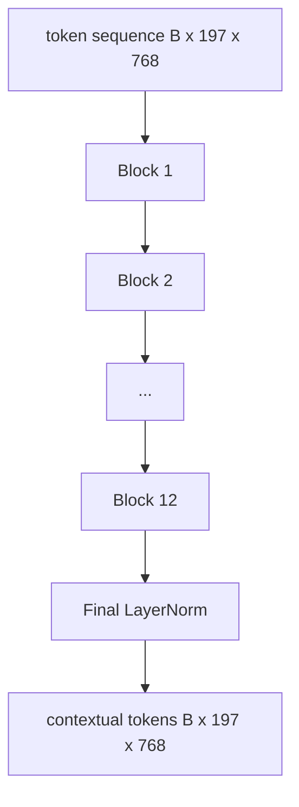
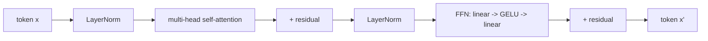

# 视觉 Transformer 编码器

> 补丁本身不能"看见"。一个带有 12 个注意力头的 12 层 pre-LN transformer 将补丁 token 序列转化为上下文 token 序列，CLS token 在其最终隐藏状态中汇聚了整幅图像的特征。本课是每个现代视觉-语言模型的引擎室。

**类型：** 构建
**语言：** Python
**前置条件：** 第 19 阶段课程 30-37（Track B 基础）
**时长：** ~90 分钟

## 学习目标

- 实现一个带有多头自注意力和前馈子层的 pre-LN transformer 块。
- 堆叠 12 个块和 12 个头以形成 ViT-Base 编码器。
- 将课程 58 的补丁前端接入编码器并运行前向传播。
- 验证 CLS token 汇聚了来自每个补丁的信息。

## 问题所在

补丁嵌入产生一个 197 个 token 的序列，每个 token 是一个对其他补丁毫无感知的向量。一张猫的图片需要每个补丁知道哪些补丁包含胡须、哪些包含背景、哪些包含眼睛。transformer 是逐层注意力构建这种感知的机制。没有它，补丁前端只是一个巧妙的分词器，没有任何理解能力。

标准方案是 12 层深、12 头宽，使用 pre-LayerNorm 放置、GELU 激活和 4 倍前馈扩展。这个方案是 CLIP ViT-L、SigLIP、DINOv2、Qwen-VL 系列、InternVL 以及 2025-2026 年每个开源视觉编码器的骨架。这个方案足够稳定，你可以阅读其中任何一篇论文并假设这个块形状，除非它们明确说明不同。

## 核心概念





### Pre-LN vs post-LN

原始 Transformer 将 LayerNorm 放在残差之后。Pre-LN（LayerNorm 在每个子层之前）是每个现代视觉-语言模型使用的版本，因为它无需学习率预热技巧就能稳定训练。区别只是前向传播中的一行代码，但在 12 层以上的深度，梯度流是天壤之别。

### 多头自注意力

每个头将 token 向量投影到自己的 `(query, key, value)` 三元组，维度为 `head_dim = hidden / num_heads`。当 `hidden = 768` 且 `heads = 12` 时，每个头的 `dim = 64`。12 个头并行注意力计算，然后它们的输出拼接回维度 768 并通过输出投影。多头的关键在于一个头可以学习"关注猫眼"而另一个头学习"关注背景渐变"，互不干扰。

### 为什么是 4 倍前馈扩展

FFN 的路径是 `hidden -> 4 * hidden -> hidden`，中间使用 GELU。因子 4 是经验性的，自 2017 年以来在语言和视觉 transformer 中一直保持。更小（2 倍）会欠拟合；更大（8 倍）在固定数据预算下会过拟合。MLP 是模型存储大部分学习到的事实的地方，更宽的中间层就是它们所在之处。

| 组件 | ViT-Base 规模下的参数量 |
|------|--------------------------|
| 每块的 qkv 投影 | `3 * 768 * 768 = 1.77M` |
| 每块的输出投影 | `768 * 768 = 590K` |
| 每块的 FFN（4 倍扩展） | `2 * 768 * 4 * 768 = 4.72M` |
| 每块的 LayerNorm | `4 * 768 = 3K` |
| 每块总计 | 约 7.1M |
| 12 个块 | 约 85M |
| 加前端 | 总计约 86M |

ViT-Base 是一个 86M 参数的编码器。按 2026 年的标准这很小（SigLIP-So400M 是 400M，Qwen-VL ViT 是 675M），但架构在宽度和深度之外是完全相同的。

### 因果掩码还是不用？

视觉 Transformer 是纯编码器且双向的：token `i` 可以关注 token `j` 的任意组合。没有掩码。课程 61 中解码器侧的交叉注意力将使用因果掩码，但在视觉编码器内部，注意力是全连接的。

### CLS token 学到了什么

CLS token 作为一个学习参数开始，自身没有补丁内容，通过每个块的注意力累积信息。到最后一层，CLS 行是整幅图像的向量摘要；下游头将这个单一向量投影到类别 logits、对比嵌入或文本解码器的交叉注意力键。

## 构建它

`code/main.py` 实现了：

- `MultiHeadSelfAttention`，带有 `qkv` 和输出投影、缩放点积注意力数学和形状断言。
- `FeedForward`，4 倍扩展的 GELU MLP。
- `Block`，一个 pre-LN 块，组合注意力和前馈子层及残差连接。
- `ViT`，12 个块的堆叠加最终 LayerNorm。
- `VisionEncoder`，将课程 58 的 `VisionFrontEnd` 连接到 `ViT` 堆叠，暴露一个 `forward()` 返回上下文序列和池化的 CLS 向量。
- 一个演示，将合成的 224x224 测试图像通过完整编码器并打印输入形状、输出形状、参数量和每隔一层的 CLS 范数。

运行：

```bash
python3 code/main.py
```

输出：测试数据被编码为 `(1, 197, 768)` 张量。CLS 范数随层组合向上漂移，然后在最终 LayerNorm 处稳定。总参数量报告约 86M。

## 使用它

此处定义的编码器，在宽度和深度之外，与 2025-2026 年每个开源 VLM 中搭载的块堆叠相同。差异在于：

- **宽度和深度。** ViT-Large 是 `hidden=1024, depth=24, heads=16`；SigLIP So400M 是 `hidden=1152, depth=27, heads=16`。相同的块。
- **池化头。** CLS 池化（本课）vs 平均池化（SigLIP）vs 注意力池化（后来的 VLM）。
- **位置处理。** 固定正弦（课程 58）vs 学习的 1D vs ALiBi vs 2D RoPE。块的数学不变。
- **寄存器 token。** DINOv2 前置 4 个额外的学习 token。一行代码。

这个块堆叠是基底。接下来的课程（60-63）建立在它之上。

## 测试

`code/test_main.py` 覆盖了：

- 单个块保持形状且对输入批次大小不变
- 注意力分数沿键轴求和为 1（softmax 健全性检查）
- 残差路径已连接（零输入仍通过 CLS token 产生非零输出）
- 4 层堆叠前向传播产生正确形状
- 梯度从 CLS 输出流到补丁投影

运行：

```bash
python3 -m unittest code/test_main.py
```

## 练习

1. 添加寄存器 token（4 个学习向量前置在 CLS 之后）并重新运行。通过最后一层 softmax 分布的熵比较注意力图的平滑度。

2. 将 pre-LN 替换为 post-LN，在合成形状分类器上训练一个 epoch。观察哪个在没有 LR 预热的情况下稳定训练。

3. 实现因果掩码作为 `attn_mask` 参数，使同一个块可以复用为解码器块。掩码形状为 `(seq, seq)`，下三角。

4. 用 `torch.profiler` 在批次大小 1、8、64 下分析前向传播。MLP 层主导运行时间，而非注意力。

5. 将一个注意力头的 q-k-v 投影替换为低秩 LoRA 适配器，冻结其余部分，并验证梯度只在你期望的地方流动。

## 关键术语

| 术语 | 含义 |
|------|------|
| Pre-LN | LayerNorm 在每个子层之前而非之后应用 |
| 自注意力 (Self-attention) | 每个 token 关注同一序列中的所有其他 token |
| 多头 (Multi-head) | 隐藏维度被拆分到 `H` 个独立的注意力头 |
| FFN 扩展 (FFN expansion) | 前馈层在收缩前扩展到 `4 * hidden` |
| CLS 池化 (CLS pooling) | 使用第一个 token 的最终隐藏状态作为图像摘要 |

## 延伸阅读

- An Image is Worth 16x16 Words (ViT, 2021) 了解编码器方案。
- DINOv2 (2023) 了解寄存器 token 和自监督预训练目标。
- SigLIP (2023) 了解平均池化变体和课程 62 中使用的 sigmoid 对比损失。
