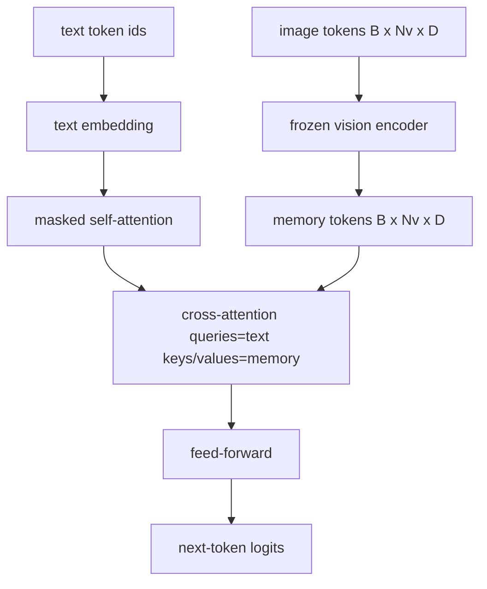
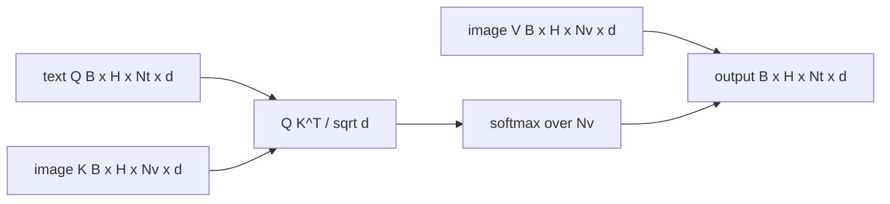

# 交叉注意力融合

> 投影层将一个图像向量与一个标题向量对齐。真正的视觉-语言解码器需要每个文本 token 关注每个补丁 token，以便模型能将每个词定位到一个区域。交叉注意力就是这种定位的方式。文本发出查询；视觉的键和值作答。本课构建交叉注意力块、因果文本自注意力以及保持两者合法的掩码形状。

**类型：** 构建
**语言：** Python
**前置条件：** 第 19 阶段课程 30-37（Track B 基础）
**时长：** ~90 分钟

## 学习目标

- 实现多头交叉注意力，其中查询流来自文本，键/值流来自视觉。
- 组合解码器块：因果自注意力 + 交叉注意力 + 前馈。
- 正确处理掩码形状：自注意力使用因果掩码，交叉注意力不使用掩码。
- 使用批量文本 token 和固定的图像 token 池运行前向传播。

## 问题所在

将图像 token 和文本 token 拼接成一个序列是一种融合选项（早期融合，Chameleon 和 Emu3 走的路径）。交叉注意力是另一种（晚期融合，Flamingo 引入的路径，此后每个 Flamingo 形状的解码器都复制了它）。在晚期融合中，文本解码器在纯文本 token 上运行，并通过每层的交叉注意力伸入图像流。

晚期融合有两个优势。首先，文本流保持干净，模型保留了纯文本能力。其次，图像流每张图像只计算一次并为每个解码步骤复用，因此即使对于长标题，生成也是廉价的。代价是每个块多一个注意力子层。

## 核心概念





### 掩码形状

解码器块内的两种注意力需要不同的掩码：

| 注意力 | 查询长度 | 键长度 | 掩码 | 原因 |
|--------|----------|--------|------|------|
| 自注意力 | `Nt`（文本） | `Nt`（文本） | 因果：下三角 `(Nt, Nt)` | 文本 token 在自回归期间不能向前看 |
| 交叉注意力 | `Nt`（文本） | `Nv`（视觉） | 无掩码 | 整幅图像对每个文本位置都可见 |

本课包含一个形状验证函数，因此混淆掩码的错误会以 `ValueError` 的形式出现，而不是静默损坏的损失曲线。

### 为什么交叉注意力不需要掩码

图像在任何文本生成之前已被完全观察。标题的 token `t` 可以关注图像的任何补丁；图像补丁没有时间顺序。一些 Flamingo 变体在交错多个图像和文本段时添加了每样本的掩码模式，但对于单张图像加标题，交叉注意力看到一切。

### 键/值缓存

图像键和值在解码开始时计算一次并保存在缓存中。每个新文本 token 使用缓存而无需重新计算。这就是推理时标题生成快速的原因：重型 ViT 只运行一次；交叉注意力为每一步复用其键和值。本课暴露了缓存并测试了缓存命中路径。

### 块组合

解码器块运行：pre-LN -> 自注意力 -> 残差 -> pre-LN -> 交叉注意力 -> 残差 -> pre-LN -> 前馈 -> 残差。三个子层，每个有自己的 LayerNorm。Flamingo 论文在交叉注意力上添加了一个学习门，使模型可以在训练时选择退出图像路径，代价是稳定性；规范基线（此处使用）没有门。

```python
class DecoderBlock:
  def forward(self, text_tokens, image_tokens, text_mask, cross_mask):
      text_tokens = text_tokens + self.self_attn(self.ln1(text_tokens),
                                                 mask=text_mask)
      text_tokens = text_tokens + self.cross_attn(self.ln2(text_tokens),
                                                  image_tokens,
                                                  mask=cross_mask)
      text_tokens = text_tokens + self.ffn(self.ln3(text_tokens))
      return text_tokens
```

## 构建它

`code/main.py` 实现了：

- `CrossAttention(hidden, heads)`，带有独立 `q` 和 `kv` 投影的多头交叉注意力。
- `CausalSelfAttention(hidden, heads)`，标准解码器的掩码自注意力。
- `DecoderBlock`，用 pre-LN 残差组合三个子层。
- `VisionLanguageDecoder`，四层解码器，由模拟视觉编码器输出和一个小文本嵌入表提供输入。
- `causal_mask(length)` 返回 `(length, length)` 下三角布尔张量。
- 一个演示，输入一批两个长度为 10 的文本序列和长度为 197 的图像记忆，打印输出形状、自注意力掩码形状和每个位置的交叉注意力输出范数。

运行：

```bash
python3 code/main.py
```

输出：解码器产生 `(2, 10, text_vocab)` logits 张量。掩码形状为 `(10, 10)`。KV 缓存复用检查确认缓存和未缓存路径的 logits 相同。

## 使用它

交叉注意力出现在两个生产系列中：

- **Flamingo 和 IDEFICS。** 每 K 个语言模型块插入一个交叉注意力子层，LM 冻结。视觉-语言适配器就是交叉注意力块加其门。
- **BLIP-2。** Q-Former 使用从固定的 32 个查询 token 到图像特征的交叉注意力，然后将查询投影到 LM 嵌入空间。

本课的块形状直接映射到两者。掩码规范（自注意力因果，交叉注意力无掩码）相同。

## 测试

`code/test_main.py` 覆盖了：

- 因果掩码是下三角的且匹配预期的布尔形状
- 交叉注意力输出形状为 `(B, Nt, hidden)`，与键长度无关
- KV 缓存路径与未缓存路径在浮点容差内匹配
- 文本和图像流之间的形状不匹配引发清晰的 `ValueError`
- 完整解码器前向传播产生正确的批次和序列形状

运行：

```bash
python3 -m unittest code/test_main.py
```

## 练习

1. 在交叉注意力残差上添加一个学习的 tanh 门（Flamingo 技巧），验证训练从接近零的初始门收敛。门从 0 开始；模型在混入图像流之前恢复纯文本行为。

2. 实现交错注意力，使同一解码器消费多个图像加多个文本段。构建防止文本段 2 关注图像 1 的每样本交叉注意力掩码。

3. 在 `Nt=64, Nv=576`（更高分辨率下的 24x24 网格）下分析交叉注意力 vs 自注意力层。交叉注意力代价为 `Nt * Nv`，在高图像分辨率下占主导。

4. 在交叉注意力图上添加查询侧 dropout，测量演示中的标题多样性（交叉图中的 dropout 增加时，标题样本方差增大）。

5. 将交叉注意力层替换为 Q-Former 风格的注意力块，其中固定的 32 token 查询池每层对图像特征进行一次注意力。

## 关键术语

| 术语 | 含义 |
|------|------|
| 晚期融合 (Late fusion) | 文本和视觉保持在独立流中；交叉注意力在每个块中桥接它们 |
| 交叉注意力 (Cross-attention) | Q 来自一个流，K 和 V 来自另一个流 |
| 因果掩码 (Causal mask) | 防止自回归期间向前看的下三角布尔掩码 |
| KV 缓存 (KV cache) | 图像键和值存储一次并为每个解码步骤复用 |
| 记忆 token (Memory tokens) | 解码器伸入的冻结图像 token |

## 延伸阅读

- Flamingo (2022) 了解带门控交叉注意力的规范晚期融合设计。
- BLIP-2 (2023) 了解 Q-Former，即一个伪装为学习查询池的交叉注意力块。
- IDEFICS (2023) 了解 Flamingo 方案的开源权重复现。
