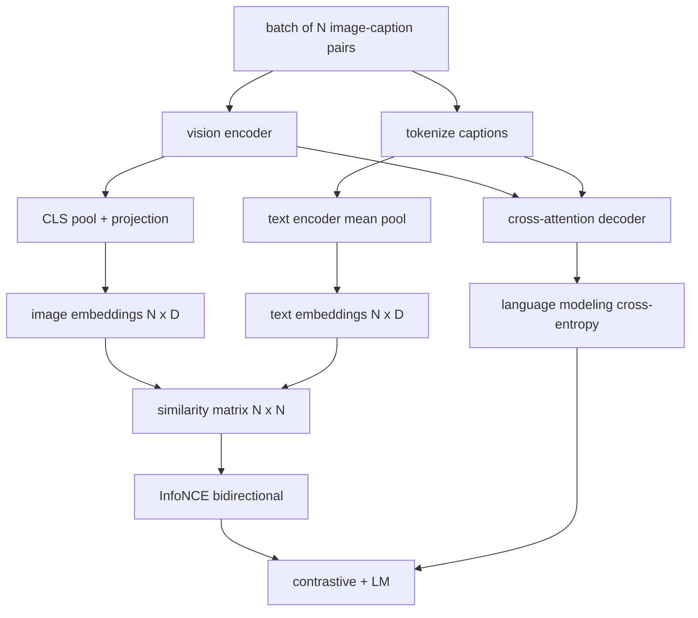

# 视觉-语言预训练

> 编码器、投影层和解码器已连接。现在一起训练它们。两个目标驱动学习：对比图像-文本损失（InfoNCE）将匹配对在联合嵌入空间中拉近，以及语言建模损失要求解码器为每张图像生成标题。两者结合，教会网络既能为标题找到正确的图像，也能为图像写出标题。

**类型：** 构建
**语言：** Python
**前置条件：** 第 19 阶段课程 30-37（Track B 基础）
**时长：** ~90 分钟

## 学习目标

- 在一批图像-标题对上实现 InfoNCE 对比损失。
- 将对比损失与自回归语言建模损失组合。
- 合成一个 200 对的模拟图像-标题语料库，无需真实数据集下载。
- 运行 50 步的演示训练循环并观察两个损失下降。

## 问题所在

视觉-语言模型需要两种能力。它必须排序：给定一个标题，从众多图像中找到正确的。它必须生成：给定一张图像，写出标题。仅用一种能力预训练模型只能得到半个系统。CLIP 搞定了排序但无法生成标题。GPT-4V 能生成标题但使用单独的检索头进行排序。多目标预训练一次通过获得两者。

InfoNCE 处理排序部分。对于一批 N 对，模型将 N 个匹配对视为正样本，将 `N^2 - N` 个不匹配对视为负样本，然后在结果 `(N, N)` 相似度矩阵上运行交叉熵损失。LM 损失处理生成部分：以图像为条件的标准下一 token 预测。两个损失都是可微的，可以共享编码器、投影器和解码器权重。

## 核心概念



### 一段话讲清 InfoNCE

将 N 个图像嵌入作为行、N 个文本嵌入作为行堆叠。两者做 L2 归一化。计算 `N x N` 矩阵 `S = I T^T / tau`，其中 `tau` 是一个学习温度。对角线条目是匹配对；非对角线条目是负样本。以沿对角线的 `argmax` 为目标应用交叉熵：行 `i` 的最高条目应在列 `i`。沿列对称地做同样的事。总计是两者的平均值。这就是八行代码的 CLIP 损失。

### 温度很重要

温度 `tau` 控制 softmax 的尖锐程度。太小（如 `tau = 0.01`）则梯度只来自最难的负样本，训练噪声大。太大则 softmax 变平，梯度消失。CLIP 将 `tau` 作为参数学习；此处的演示也这样做。

### 语言建模损失

解码器通过交叉注意力消费图像记忆 token 并在每个位置预测下一个文本 token。损失是以下一位置为目标的标准交叉熵。填充位置从损失中掩码排除。

### 组合损失

`total = contrastive + lm_weight * lm`，其中 `lm_weight` 是一个标量（通常为 1.0）。两个损失共享到编码器和投影层的梯度；只有解码器接收 LM 损失梯度。这是 CoCa、BLIP 和 SigLIP 风格模型都使用的多任务方案，权重各有不同。

| 组件 | 损失面 | 影响 |
|------|--------|------|
| InfoNCE | 联合空间中的对排序 | 编码器 + 投影 + 文本头 |
| LM | 以图像为条件的 token 预测 | 编码器 + 投影 + 解码器 |
| 组合 | 多任务 | 整个堆叠 |

### 为什么 50 步对演示足够

模拟语料库是一个 200 对的合成集，包含随机图像和随机标题 id。在批次大小 16 下 50 步 SGD 后，即使绝对值仍高于真实数据模型能达到的水平，两个损失都明显下降。演示的目的是确认梯度管道端到端工作，以及添加 LM 损失不会破坏对比目标。

## 构建它

`code/main.py` 实现了：

- `MultimodalModel`，组合一个小型 ViT 编码器、MLP 投影器、一个微型文本侧编码器（嵌入 id 的均值池化）和课程 61 的交叉注意力解码器。
- `info_nce_loss(image_emb, text_emb, temperature)`，双向 CLIP 风格对比损失。
- `lm_loss(logits, target_ids, padding_id)`，掩码的下一 token 交叉熵。
- `make_mock_corpus(seed, n_pairs)`，返回 200 个确定性（图像，caption_ids）对。
- 一个训练循环，运行 50 步，批次大小 16，Adam 优化器，和一个学习的 log-温度参数。两个损失每 5 步打印一次。

运行：

```bash
python3 code/main.py
```

输出：对比损失从约 `ln(16) = 2.77` 下降到 2.4；LM 损失从随机均匀基线 `ln(512) ≈ 6.24` 下降到约 4.7。两个下降证明梯度连接正确。真实模型训练数百万步；动态是相同的。

## 使用它

这是以下模型搭载的相同损失方案：

- **CLIP (2021)。** 仅图像-文本对比，带有单独的冻结编码器标题探测。
- **CoCa (2022)。** 一个模型中图像-文本对比加图像标题 LM 损失。正是本课构建的模式。
- **BLIP (2022) 和 BLIP-2。** 对比加 LM 加图像-文本匹配头。三个损失组合。
- **SigLIP (2023)。** 将 InfoNCE 替换为 sigmoid 对损失；相同的对比角色，不同的函数形式。
- **LLaVA 系列。** 两阶段训练，第一阶段是对齐（冻结 LM 上的余弦），第二阶段添加解冻 LM 的 LM 损失。课程 60 对应第一阶段；本课对应第二阶段。

## 测试

`code/test_main.py` 覆盖了：

- InfoNCE 损失在图像/文本行间对称
- InfoNCE 损失在相似度矩阵为大正数完美对角线时返回 0
- LM 损失正确掩码填充位置
- 模型前向传播无错误地产生两个损失
- 5 步训练循环减少组合损失

运行：

```bash
python3 -m unittest code/test_main.py
```

## 练习

1. 将 InfoNCE 替换为 SigLIP 风格的 sigmoid 对损失，比较在模拟语料库上的收敛。

2. 添加难负样本挖掘步骤：每隔一个批次，从上一批次选择最难的离对角线对并附加。训练并检查对比损失是否下降更快。

3. 在联合嵌入之上添加图像-文本匹配二元头（真/假：这些匹配吗？）作为第三个损失，复现 BLIP 的三头设置。

4. 将模拟语料库替换为从马尔可夫链抽取的标题 id 序列，其转移矩阵以图像哈希为条件。标题损失应该下降更多，因为存在实际可学习的信号。

5. 用 `lm_weight = 0` 和 `lm_weight = 1` 分别训练同一模型。比较对比损失；LM 损失不应使排序目标退化。

## 关键术语

| 术语 | 含义 |
|------|------|
| InfoNCE | 噪声对比估计：相似度矩阵上的交叉熵 |
| 温度 (Temperature) | 控制对比 softmax 尖锐程度的标量 |
| 难负样本 (Hard negative) | 模型感到困惑的离对角线对，对采样有用 |
| LM 损失 (LM loss) | 标题侧的标准下一 token 交叉熵 |
| 联合嵌入空间 (Joint embedding space) | 投影后图像和文本向量生活的共享空间 |

## 延伸阅读

- CLIP 论文了解原始对比方案。
- CoCa 论文了解一个模型中的对比加标题生成。
- SigLIP 论文了解 sigmoid 对损失变体及其更好的扩展性原因。
