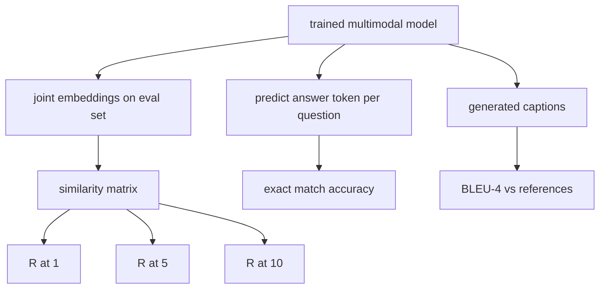

# 多模态评估

> 训练是循环的一半。另一半是度量。本课从原语构建三个评估面：图像-标题检索报告为 R@1、R@5、R@10；视觉问答报告为精确匹配准确率；图像标题生成报告为 BLEU-4。每个指标都是模型输出的函数，加上一个可在几秒内运行的合成评估套件。

**类型：** 构建
**语言：** Python
**前置条件：** 第 19 阶段课程 58-62（Track E 基础：编码器、transformer、投影、交叉注意力融合、预训练）
**时长：** ~90 分钟

## 学习目标

- 从图像和标题嵌入之间的相似度矩阵计算 Recall@K。
- 从将（图像，问题）对映射到固定答案词汇表的模型计算精确匹配 VQA 准确率。
- 不使用任何外部库，从生成和参考 token 序列计算 BLEU-4。
- 在课程 62 训练模型之上构建的合成套件上运行所有三个评估。

## 问题所在

诱惑是在训练损失平台期时宣布多模态模型完成。训练损失度量训练分布上的拟合；它不度量模型是否能在留出批次中排序对、回答问题或写出人类可接受的标题。三个评估面是标准的：

- **检索（R@1, R@5, R@10）。** 为查询标题构建联合嵌入；按余弦相似度对评估池中的每张图像排序；报告匹配图像是否落在前 1、前 5、前 10。对称（图像到文本）形式以相同方式运行。
- **视觉问答（精确匹配）。** 给定（图像，问题），模型输出一个答案 token。精确匹配是每样本一位：预测答案是否等于参考答案？在评估集上取平均。
- **标题生成（BLEU-4）。** 生成标题。计算 1-gram 到 4-gram 精度对参考标题的几何平均，加上简短惩罚。多参考是标准形式（一张图像，多个参考标题）。

每个指标都是一个薄函数。本课全部用代码构建，使数学具体化且评估面在你的控制之下。真实基准套件（MS-COCO、VQA v2、GQA、OK-VQA）插入相同的函数形状。

## 核心概念



### 从相似度矩阵计算 Recall@K

构建图像和标题嵌入之间的 `(N, N)` 余弦相似度矩阵。对每行，按相似度降序排列列。Recall@K 是对角线列索引落在前 K 个位置内的行比例。对称 Recall@K（标题到图像）在转置矩阵上计算。两个数字都报告。对于 N=100 的评估，R@1 = 0.6 意味着 100 个标题中有 60 个检索到正确图像作为最佳匹配。

### VQA 精确匹配

对每个（图像，问题，答案），编码图像，嵌入问题，通过解码器融合，读出下一个 token。预测的 token id 与参考 id 比较；相等则正确。在评估集上取平均。真实 VQA 数据集每个问题附带多个人工标注答案并使用软准确率公式（如果 10 个标注者中至少 3 个同意则为 1.0，以下按比例缩放）；本课为清晰起见使用单答案精确匹配。

### BLEU-4

```text
BLEU-4 = BP * exp(mean(log p1, log p2, log p3, log p4))
```

其中 `p_n` 是修改后的 n-gram 精度（出现在任何参考中的生成 n-gram 的裁剪计数，除以总生成 n-gram），`BP` 是简短惩罚：

```text
BP = 1                if generated length > reference length
   = exp(1 - r/g)     otherwise, where r is reference length and g is generated
```

对于某些 `p_n` 为零的小样本需要平滑。实现使用 Chen 和 Cherry 的"方法 1"（对任何零计数的分子和分母加 1），这是低计数体制下最安全的默认值。

### 合成评估套件

一个 50 样本的评估套件从课程 62 中使用的相同模拟语料库模式在内存中构建，使用留出的种子。三个列表组成套件：

- `pairs`：50 个（图像，caption_ids）对用于检索。
- `vqa`：50 个（图像，question_ids，answer_id）三元组。
- `caps`：50 个（图像，[reference_caption_ids, ...]）条目，每张图像最多 3 个参考。

套件从种子确定性生成，且与训练语料库留出，因此指标在模型从未见过的数据上计算。将套件持久化为 JSON 留作练习（见下文）。

| 指标 | 范围 | 随机基线（N=50） |
|------|------|-------------------|
| R@1 | 0 到 1 | 0.02 (1 / N) |
| R@5 | 0 到 1 | 0.10 |
| R@10 | 0 到 1 | 0.20 |
| VQA EM | 0 到 1 | 1 / vocab |
| BLEU-4 | 0 到 1 | 小但非零 |

对于合成数据上的 50 步训练运行，指标不会很高；预期它们高于随机基线，这就是演示检查的内容。

## 构建它

`code/main.py` 实现了：

- `recall_at_k(sim_matrix, k)`，返回两个方向的 `[0, 1]` 范围内的浮点数。
- `vqa_exact_match(predictions, references)`，返回 `int` 相等性的均值。
- `bleu4(generated, references, smoothing=True)`，支持多参考。
- `build_eval_suite(seed, n_samples, vocab_size, max_len)`，返回三个确定性评估列表。
- `evaluate(model, suite)`，运行所有三个指标并返回数字 `dict`。
- 一个演示，加载课程 62 的一个全新初始化多模态模型，评估它，然后训练 50 步并再次评估，打印前后指标。

运行：

```bash
python3 code/main.py
```

输出：前后指标表显示检索从接近随机改善到模型学到的信号，VQA 改善到随机以上，BLEU-4 改善（合成结构足以产生 4-gram 精度提升）。

## 使用它

每个指标直接映射到一个生产基准：

- **检索。** MS-COCO 5K val、Flickr30K、ImageNet 零样本都是同一相似度矩阵上的 R@K 问题。用真实文件替换合成评估，函数签名不变。
- **VQA。** VQA v2、GQA、OK-VQA 使用相同的精确匹配形状（VQA v2 用软准确率代替单答案 EM）。
- **BLEU-4。** MS-COCO 标题生成、NoCaps、Flickr30K 标题生成都使用 BLEU-4 加 CIDEr 和 METEOR。添加 CIDEr 只需一个函数。

对于真实基准，将 `build_eval_suite` 替换为真实加载器，保持函数体不变。数学是与基准无关的。

## 测试

`code/test_main.py` 覆盖了：

- recall@k 在完美单位相似度矩阵上返回 1.0，在翻转矩阵上对 k < N 返回 0.0
- recall@k 遵守 `k <= N` 上界
- bleu4 在生成完全等于某个参考时返回 1.0
- bleu4 在不相交词汇上返回 0.0
- vqa 精确匹配等于相等对的比例
- build_eval_suite 返回预期数量的对、vqa 项和标题条目

运行：

```bash
python3 -m unittest code/test_main.py
```

## 练习

1. 在标题生成指标中添加 CIDEr。CIDEr 使用 TF-IDF 加权 n-gram，奖励信息量大的 token。

2. 实现软准确率 VQA：每个问题多个人工答案，准确率为 `min(human_count / 3, 1)`（如果有匹配）。复现 VQA v2。

3. 添加 `bleu4` 的 NaN 安全变体，处理空生成序列而不崩溃。

4. 在 R@K 旁计算平均倒数排名（MRR）。MRR 对正确项落在前 K 之外的位置敏感；R@K 对是否落在前 K 内敏感。

5. 在训练期间的五个检查点（步骤 0、10、20、30、40、50）对模型运行评估并绘制学习曲线。确认指标轨迹跟踪损失轨迹。

## 关键术语

| 术语 | 含义 |
|------|------|
| R@K | 正确匹配落在前 K 结果中的查询比例 |
| 精确匹配 (Exact match) | 最简单的 VQA 评分：预测答案等于参考答案 |
| BLEU-4 | 1 到 4-gram 精度的几何平均，带简短惩罚 |
| 多参考 (Multi-reference) | 标题生成指标接受每张图像的多个参考标题 |
| 留出 (Held-out) | 评估集从与训练语料库不相交的种子采样 |

## 延伸阅读

- VQA v2 论文了解软准确率公式和数据集统计。
- CIDEr 论文了解 TF-IDF 加权 n-gram 标题生成。
- BLEU 原始论文 (Papineni et al., 2002) 了解平滑变体。
- MS-COCO 标题生成评估脚本了解规范参考实现。
