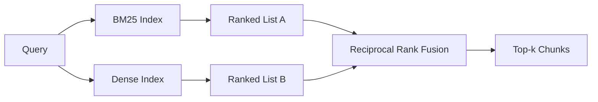

# 混合检索：BM25 与稠密嵌入

> 词法检索和语义检索在相反的查询分布上失败。使用倒数排名融合的混合检索不是插值，而是投票——而且投票在每个查询类别上都赢。

**类型：** 构建
**语言：** Python
**前置课程：** 第 11 阶段课程 04（嵌入）、06（RAG）；第 19 阶段 Track B 基础（课程 20-29）；第 19 阶段课程 64（分块策略）
**时长：** ~90 分钟

## 学习目标
- 从 Robertson 和 Sparck Jones 公式从零实现 BM25，包含字段加权、文档长度归一化和可调 k1 与 b。
- 在确定性模拟嵌入之上构建稠密检索器，使循环可离线运行。
- 精确实现 Cormack、Clarke 和 Buettcher 于 2009 年发表的倒数排名融合，并解释为什么它优于分数加权插值。
- 调整 RRF k 常数和各模态权重，在小型固定语料库上读取权衡关系。

## 问题所在

词法检索在查询携带语料库中逐字出现的字面标识符时胜出。查询 `AbortMultipartOnFail` 通过 BM25 在微秒内返回正确的 Go 函数。同样的查询经嵌入后，位于三个相似度聚类的边界，稠密检索器将错误的文件排在第一位。

稠密检索在查询被改写远离语料库的字面词元时胜出。用户问"上传失败时我们怎么处理"从未输入 abort 或 multipart。BM25 返回关于"上传大文件"的文档块，因为该页面包含 uploads 一词。稠密检索找到摘要中提及取消的 abort 函数。

两者之间的选择不是静态的。查询分布才是变量。生产 RAG 系统从同一端点处理两个类别，因此检索必须同时处理两者。这就是混合检索。合并步骤是必须正确的部分。

## 核心概念



### BM25 一段话讲清

BM25 对查询-文档对的评分方式是：对查询词项求和，将逆文档频率因子乘以一个包含长度归一化校正的饱和词频因子。两个旋钮。`k1` 控制词频饱和；默认值 1.5 是发表的建议值，没有基准测试不要改动。`b` 控制文档长度的权重；默认值 0.75 表示较长文档被惩罚，但不是线性的。

IDF 公式使用平滑的 Robertson 和 Sparck Jones 定义，即 `log((N - df + 0.5) / (df + 0.5) + 1)`。对数内部的加一确保当一个词项出现在超过半数语料库时 IDF 仍为正值。这在停用词技术上罕见的小型语料库中很重要。

字段加权让你告诉 BM25 符号名上的匹配比正文中的匹配更重要。实现方式是在索引期间对词项计数乘以乘数，而非评分时。这保持数学一致，避免每个字段单独评分。

### 稠密检索一段话讲清

用嵌入模型将每个块嵌入到固定维度向量中。查询时，嵌入查询，按余弦相似度对每个块排序，返回 top-k。模型是决定质量的变量。检索算法本身只有两行：点积和排序。

本课程使用确定性基于哈希的嵌入，这样你可以在没有网络调用的情况下阅读融合数学。哈希将词元键控的偏移量求和到 96 维向量中并归一化。余弦排名在运行间是确定性的，这是测试套件的要求。

### 倒数排名融合，已发表的公式

两个排序列表。对于出现在任一列表中的每个候选，求其倒数排名贡献之和。2009 年论文使用 `1 / (k + rank)`，k 等于 60 作为默认值。按总分排序。这就是整个算法。

发表的常数 k = 60 不是任意的。k = 60 时，排名 1 的贡献为 1 / 61，排名 10 的贡献为 1 / 70。贡献缓慢衰减，因此深层候选仍然有投票权。较小的 k 使顶部结果主导。较大的 k 使贡献曲线变平。

我们的实现中有两个可调旋钮。`k` 常数。一对各模态权重，这样当你有先验证据表明某个模态在你的语料库上更好时可以提升 BM25 或稠密。将排名贡献乘以权重是最简单的原则性实现；它保留了排名衰减形状并保持无标度。

### 为什么融合优于分数加权插值

BM25 分数无界且取决于语料库。余弦相似度有界在 -1 到 1。线性组合 `alpha * bm25 + (1 - alpha) * cosine` 需要按语料库调整 alpha，每次重新索引都会失效。基于排名的融合不会。两个排名在模态间可比。自 2010 年以来，已发表的 RRF 基线在每个公开 TREC 赛道上都击败分数插值。

这与你在 Vespa 和 Weaviate 文档中看到的关于 RankFusion 与 RRF 的论点相同。他们得出了相同结论：除非你有非常强的证据来插值分数，否则保持基于排名。

## 构建它

`code/main.py` 实现了：

- `tokenize(text)` - 快速正则分词器。
- `BM25Index` - 字段加权，包含 `add` 和 `search` 以及可调 k1、b。
- `mock_embed`、`DenseIndex` - 与课程 64 相同的确定性嵌入，使块可比。
- `rrf(rankings, k, weights)` - 带多模态权重的已发表融合。
- `HybridRetriever` - 组合 BM25 和稠密。
- 一个演示 `main()` 加载小型固定语料库，运行三个分别针对每个检索器强项和弱项的查询，打印每个模态产生的排名以及融合列表。

运行：

```bash
python3 code/main.py
```

并排阅读演示输出。字面标识符查询落在 BM25 排名 1、稠密排名 4、RRF 排名 1。改写查询落在 BM25 排名 6、稠密排名 1、RRF 排名 1。歧义查询落在 BM25 排名 3、稠密排名 3、RRF 排名 1。融合不是打破平局；它是在每个查询类别上都赢的系统。

## 调整旋钮

| 旋钮 | 默认值 | 何时上调 | 何时下调 |
|------|---------|----------------|------------------|
| BM25 k1 | 1.5 | 词项在文档中重复且你希望频率更重要 | 文档很短且词项重复是噪声 |
| BM25 b | 0.75 | 长文档确实每词传达更少信息 | 文档长度与主题无关 |
| RRF k | 60 | 深层候选应继续投票 | 排名 1 应主导 |
| BM25 权重 | 1.0 | 语料库包含字面标识符且查询匹配它们 | 查询是用户改写的 |
| 稠密权重 | 1.0 | 查询被改写 | 查询是字面的 |

通过在留出查询集上重新运行课程 68 的评估工具来调整，而非凭直觉。

## 演示会隐藏的失败模式

**词外词元。** BM25 的 IDF 从语料库计算，因此仅出现在查询中的词项贡献为零。稠密嵌入为同一词项幻觉出一个向量。对于语料库外的标识符，稠密模态返回看起来合理但错误的邻居。融合吸收了这一点，因为 BM25 不返回任何结果且排名贡献降为零，但前提是你按文档去重而非按块去重。

**停用词主导。** BM25 对词"the"产生语料库上的均匀排名。在索引器中过滤停用词，或接受高 IDF 词项自然主导。

**跨模态相同内容。** 如果你的语料库小到 BM25 的 top-1 也是稠密的 top-1，RRF 给你相同的 top-1 和相同的邻居。这是正确行为，不是失败，但它使融合看起来不可见。在评估中添加对抗性查询对以验证融合确实在工作。

## 使用它

生产模式：

- 进程内索引 BM25；瓶颈是词频字典，不是向量。
- 在独立存储中索引稠密向量（本课程使用平面列表；生产中你会使用 HNSW）。
- 并行运行两个查询；融合是对并集的常数时间合并。
- 持久化每个检索命中结果的模态，以便下游重排器可以看到哪个模态为其投票。

## 发布它

课程 66 取本课程的融合 top-k 并用交叉编码器重排。课程 68 用精确率、召回率、MRR 和 nDCG 评估整个流水线。本课程的混合检索器是课程 69 端到端系统的第一阶段。

## 练习

1. 将 `mock_embed` 替换为提供商的真实模型。重新运行演示并报告仅稠密排名在改写查询上的变化。
2. 添加第三模态：单独索引的块摘要，作为第三个排序列表融合。测量增益。
3. 扫描 RRF k 从 10、30、60、100 到 200。绘制课程 68 的 recall@k 曲线。报告曲线上 k 的峰值。
4. 正确实现 BM25F（每字段长度归一化而非乘数技巧），在符号匹配最重要的语料库上比较。

## 关键术语

| 术语 | 人们常说的 | 实际含义 |
|------|-----------------|------------------------|
| BM25 | "词法检索" | 概率排序：idf × 饱和 tf × 长度归一化 |
| RRF | "排名融合" | 跨排序列表的 1 / (k + rank) 之和；k = 60 默认 |
| k1 | "TF 饱和" | 控制重复词项停止增加分数的速度 |
| b | "长度惩罚" | 0 表示忽略文档长度，1 表示完全归一化 |
| 字段加权 | "符号提升" | 索引期间重复词元以提升该字段的匹配 |
| 基于排名 vs 基于分数的融合 | "为什么 RRF 优于线性" | 排名在模态间可比；分数不可比 |

## 延伸阅读

- Cormack, Clarke, Buettcher, "Reciprocal Rank Fusion outperforms Condorcet and individual rank learning methods", SIGIR 2009
- Robertson, Walker, Beaulieu, Gatford, Payne, "Okapi at TREC-3"（原始 BM25 论文）
- [Vespa: Hybrid Retrieval with BM25 and Embeddings](https://docs.vespa.ai/en/tutorials/hybrid-search.html)
- [Weaviate: Hybrid Search](https://weaviate.io/developers/weaviate/search/hybrid)
- 第 11 阶段课程 06 - RAG 基础
- 第 19 阶段课程 64 - 输出在此处被索引的分块器
- 第 19 阶段课程 66 - 消费融合 top-k 的交叉编码器重排器
