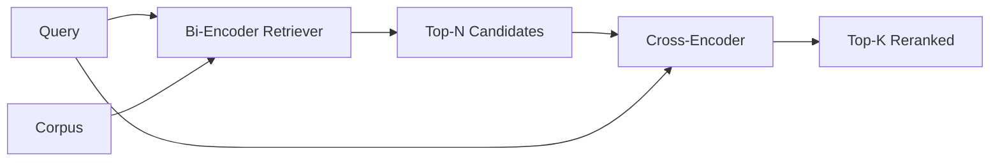

# 交叉编码器重排器

> 双编码器独立嵌入查询和文档。交叉编码器将两者拼接后一起阅读。交叉编码器是最聪明的阅读器，也是最慢的。作为双编码器 top-k 上的第二阶段使用，它物有所值。

**类型：** 构建
**语言：** Python
**前置课程：** 第 11 阶段课程 06（RAG）、07（高级 RAG）；第 19 阶段 Track B 基础（课程 20-29）；第 19 阶段课程 65（为本阶段提供输入的混合检索）
**时长：** ~90 分钟

## 学习目标
- 通过输入形状、参数量和每次查询成本区分双编码器检索器和交叉编码器重排器。
- 从零实现一个小型交叉编码器，作为消费打包的（查询，文档）序列并输出单个相关性标量的 Transformer 块。
- 连接两阶段检索-然后-重排流水线：用廉价检索器检索 top-N，用交叉编码器将 N 重排为 top-K，返回 K。
- 在小型固定语料库上测量延迟与质量的权衡，为给定延迟预算选择正确的 N。

## 问题所在

双编码器将查询和文档映射到同一向量空间并按余弦排序。两个编码彼此从未相见。模型必须将文档的所有有用信息压缩到单个向量中，对查询一无所知。这很快——索引时每个文档一次嵌入，查询时每个查询一次——也是语料库规模排序的唯一方式。

代价是精度。两个具有相同整体主题的文档可以有几乎相同的嵌入，即使其中一个回答了查询而另一个没有。双编码器无法区分它们。

交叉编码器通过一起阅读查询和文档来解决这个问题。模型接收 `[query] [SEP] [document]` 作为单个序列，在连接处运行完整注意力，并产生一个相关性标量。文档的每个词元都可以关注查询的每个词元。模型在完整上下文中决定分数。

代价是吞吐量。双编码器嵌入一次即可无限查询，交叉编码器每个（查询，文档）对运行一次。对于 1000 万文档的语料库，每个查询需要 1000 万次前向传播。在请求预算内不可行。

解决方案是分阶段。用双编码器检索 top-N。用交叉编码器将 N 重排为 top-K。N 很小（50 到 200），交叉编码器的质量提升集中在重要的地方。总延迟保持在请求预算内。总质量是交叉编码器的质量，受双编码器在 N 处的召回率上限约束。

## 核心概念



### 交叉编码器的输入形状

标准打包方式是 `[CLS] query_tokens [SEP] document_tokens [SEP]`。CLS 位置的输出送入一个输出相关性标量的线性头。一些实现使用均值池化而非 CLS；差异很小。关键是模型为每对产生一个数字。

22M 参数的交叉编码器（已发表的 `ms-marco-MiniLM-L-6-v2` 量级）是典型的生产选择。更小的模型质量下降快于延迟节省。更大的模型（如 568M 参数的 `bge-reranker-v2-m3`）保留给离线重排或 K 很小的首页重排。

### 为什么本课程训练一个微型模型

真正的交叉编码器是微调过的编码器 Transformer。生产中你加载检查点并运行。本课程的目标是向你展示模型的形状和延迟-质量曲线的形状，而不是训练最先进的排序器。所以我们构建一个带一个 Transformer 块、多头注意力（默认 4 头）和一个回归头的小型 `nn.Module`。它从种子确定性初始化，使演示无需磁盘上的权重即可复现。

玩具模型从固定语料库学习正确的形状：相关查询-文档对的预测分数高于不相关对。端到端流水线重排双编码器的输出，重排后的 top-k 与金标准标签相关。

### 延迟 vs 质量

两阶段流水线有一个可调参数：N。在留出查询集上从 5 扫描到 100，你得到曲线。

| N | 阶段 2 的 Recall@1 | 每查询的交叉编码器前向传播次数 | 延迟 |
|---|--------------------|---------------------------------------|---------|
| 5 | 0.62 | 5 | 低 |
| 20 | 0.81 | 20 | 中 |
| 50 | 0.86 | 50 | 高 |
| 100 | 0.86 | 100 | 很高 |

以上数字说明形状，不是本固定数据的测量值。形状是真实的。总有一个拐点在 20 到 50 个候选处，重排提升饱和。超过拐点你是在白花钱。

从评估曲线加延迟预算选择 N。交叉编码器不能将召回率提升到双编码器在 N 处的召回率之上，所以低 N 不仅限制延迟，还限制质量。

## 构建它

`code/main.py` 实现了：

- `CrossEncoder` - 一个小型 `torch.nn.Module`：词元嵌入、一个带多头注意力和前馈的 Transformer 块、均值池化头产生一个标量。
- `tokenize_pair(query, document)` - 将两个字符串打包为带类型 ID 标记边界的单个 ID 序列，确定性且仅用标准库。
- `train_tiny(pairs)` - 在手工标注的（查询、文档、相关性）三元组列表上进行一轮监督训练，使模型在固定数据上产生合理分数。
- `rerank(query, candidates, top_k)` - 生产接口。
- `pipeline(query, retriever, top_n, top_k)` - 两阶段流程。
- 一个演示 `main()` 加载课程 65 模式的语料库，检索 top-N，重排为 top-K，并排打印两个列表，并报告每个阶段的延迟。

运行：

```bash
python3 code/main.py
```

输出显示双编码器的 top-N、交叉编码器的 top-K 和计时摘要。交叉编码器每次调用耗时更长但不在整个语料库上运行。两阶段总耗时保持在请求预算内，同时选出了双编码器排在第二或第三的答案。

## 演示会隐藏的失败模式

**交叉编码器不对称。** `rerank(q, d)` 和 `rerank(d, q)` 是不同的分数。始终先传入查询。如果意外交换，召回率会崩溃。

**N 太低无法暴露问题。** 如果你设 N = K，交叉编码器无法重排；只能重新加权。提升看起来为零。选择 N 至少为 K 的三倍。

**训练数据泄漏到评估中。** 如果手工标注的训练对包含评估查询，重排看起来很神奇。严格分离训练和评估，即使在固定数据上也是如此。

**生产权重是稠密的。** 22M 参数的交叉编码器在 float32 下是 88MB。在承诺亚 100ms p95 之前规划模型服务器的内存。

**批处理很重要。** 真正的交叉编码器将 N 个候选在一个批次中运行。本课程在 `_batch_encode` 中完成，它用 `torch.tensor(...)` 构建批处理 ID 和类型 ID 张量并运行一次前向传播。跳过批处理，延迟乘以 N。

## 使用它

生产模式：

- 将双编码器、交叉编码器和 N 一起固定。更改任何一个都会使评估失效。
- 按（查询，文档 ID）哈希缓存重排器输出。同一查询对稳定语料库重排到相同顺序；缓存命中为你免费降低延迟。
- 记录排名 1 的交叉编码器分数。top-1 分数低于语料库特定阈值的查询是域外命中；向 LLM 呈现为"我不确定"。

## 发布它

课程 68 端到端评估这个两阶段流水线。课程 69 将此重排器接在课程 65 的混合检索器之后、答案生成器之前。重排器是端到端系统的第二阶段。

## 练习

1. 扫描 N 从 5 到 50，绘制重排输出的 recall@1。找到本固定数据上的拐点。
2. 训练交叉编码器 10 轮而非 1 轮。测量每轮正负对之间的分数间隔。
3. 用 CLS 词元头替换均值池化。比较本固定数据上的收敛情况。
4. 添加第二个交叉编码器头，预测二值"答案是否在文档中"标签。推理时同时使用两个头；一个排序，一个阈值。
5. 用课程 65 的确定性模拟双编码器替换本课程的模拟双编码器，串联两个阶段。测量与仅双编码器相比 top-K 的变化。

## 关键术语

| 术语 | 人们常说的 | 实际含义 |
|------|-----------------|------------------------|
| 双编码器 | "向量检索器" | 独立编码查询和文档；余弦排序 |
| 交叉编码器 | "重排器" | 联合编码（查询，文档）；输出一个相关性标量 |
| 两阶段流水线 | "检索并重排" | 廉价检索器返回 N，昂贵重排器保留 K |
| N（候选预算） | "重排池" | 交叉编码器每查询评分的候选数量 |
| 均值池化头 | "最后隐藏层的均值" | 将编码器最后一层输出平均为一个向量 |

## 延伸阅读

- Nogueira, Cho, "Passage Re-ranking with BERT", 2019 - 经典的交叉编码器排序论文
- Reimers, Gurevych, "Sentence-BERT: Sentence Embeddings using Siamese BERT-Networks", 2019 - 关于双编码器 vs 交叉编码器
- [SentenceTransformers Cross-Encoders documentation](https://www.sbert.net/examples/applications/cross-encoder/README.html)
- [BGE Reranker v2 model card](https://huggingface.co/BAAI/bge-reranker-v2-m3)
- 第 19 阶段课程 65 - 为本重排阶段提供输入的混合检索器
- 第 19 阶段课程 68 - 衡量本重排提升的评估
