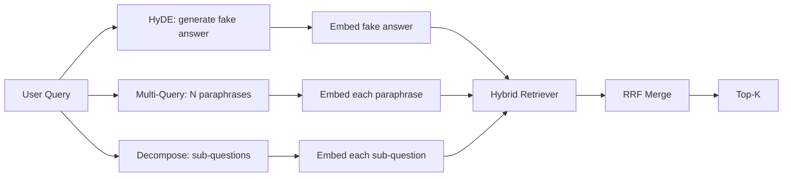

# 查询改写：HyDE、多查询与分解

> 用户输入的查询不是检索器想要的查询。改写在检索之前弥合差距，使索引看到更接近答案样貌的内容。

**类型：** 构建
**语言：** Python
**前置课程：** 第 11 阶段课程 04（嵌入）、06（RAG）；第 19 阶段 Track B 基础（课程 20-29）；第 19 阶段课程 64 和 65
**时长：** ~90 分钟

## 学习目标
- 实现假设性文档嵌入（HyDE）：生成假答案，嵌入它，用该向量而非查询向量进行检索。
- 实现多查询扩展：将一个查询改写为 N 个释义，分别检索，通过倒数排名融合合并并集。
- 实现查询分解：将复杂问题拆分为子问题，按子问题检索，合并。
- 在固定数据上并排比较三种改写器，解释每种策略何时胜出。
- 连接一个产生确定性、基于固定数据输出的模拟 LLM，使改写器循环可离线运行。

## 问题所在

用户输入"上传失败且预算用完时我们团队怎么做？"。语料库中有一篇文档说"AbortMultipartOnFail 中止进行中的 S3 分段上传，并在上传失败时递减每桶重试预算"。查询和文档不共享名词短语。BM25 未命中。双编码器将文档排在第三或第四，因为查询向量落在嵌入空间中偏好关于取消作业而非中止上传文档的区域。课程 66 的两阶段重排如果答案在 top-N 中可以挽救，但如果它连 top-N 都没达到，重排器永远不会看到它。

修复方法是在查询接触检索器之前改写它。2023 年论文"Precise Zero-Shot Dense Retrieval without Relevance Labels"（Gao 等人）引入了 HyDE：让 LLM 写出能回答查询的文档，嵌入该假设性文档，用其嵌入作为检索向量。假设性文档位于嵌入空间的正确区域，因为它以语料库的口吻写成。查询向量则不是。

两种相关技术与 HyDE 搭配。多查询扩展（Microsoft 的 GraphRAG 使用的术语）生成查询的 N 个释义，分别检索后合并。分解（在 2024 年 Stanford DSPy 工作中作为"子查询分解"推广）将"上传失败且预算用完时我们团队怎么做"拆分为两个问题："上传失败时会发生什么"和"重试预算用完时会发生什么"。两次检索，一个合并结果，答案的两部分都可达。

本课程实现所有三种并在同一固定语料库上运行。

## 核心概念



### HyDE 详解

HyDE 用 LLM 写的假设性文档向量替换用户的查询向量。提示很短：

```
You are a domain expert. Write a one-paragraph passage that answers the question
below. Use the same vocabulary and phrasing the documentation in this domain would
use. Do not refuse. Do not say you do not know.

Question: {user_query}

Passage:
```

LLM 的答案作为事实答案是错误的，因为 LLM 不知道你的语料库。这没关系。检索器不关心事实正确性，只关心词元分布。假设性段落包含"abort"、"multipart"、"bucket"、"budget"这些词，因为这是该主题文档段落会使用的措辞。嵌入该段落。向量落在真实段落附近。

生产中你将假设性文档限制在两三句话。更长的假设性收集更多噪声。更短的则失去 HyDE 需要的词法信号。

### 多查询扩展详解

生成用户查询的 N 个释义。最简单的提示：

```
Rewrite the following question in {N} different ways. Each rewrite must preserve
the original intent. Number them 1 to {N}. Do not add explanations.
```

对每个释义检索 top-k。用 RRF（课程 65 的同一算法）合并 N 个排序列表。廉价、并行、确定性。

多查询在用户的措辞是多种等效提问方式之一，且任何改写都能更好地提问时胜出。在所有改写都同样糟糕时失败，因为原始查询以相同方式糟糕。

### 分解详解

单次检索无法满足多方面的问题。分解让 LLM 将问题拆分为子问题，系统按子问题检索。提示：

```
The following question may require information from multiple distinct topics.
Decompose it into a list of sub-questions. Each sub-question must be answerable
independently. If the question is already atomic, return it unchanged.

Question: {user_query}
```

按子问题检索。合并。分解是包含连词、多从句比较或两个不相关主题的问题的正确工具。原子问题的错误工具；分解器的工作是返回单个问题而非发明假子问题。

### 为什么三种都存在

三者互补。HyDE 弥合查询-语料库词元差距。多查询覆盖释义方差。分解覆盖多主题查询。生产系统运行所有三种并按查询选择策略（课程 69 的端到端系统展示了选择器）。

## 模拟 LLM

本课程离线运行。模拟 LLM 是一个以用户查询为键的小型查找表，加上对未见查询的回退。查找表包含：

- 对每个固定查询：一段写好的假设性段落、三个释义和一个分解。
- 对未知查询：确定性变换：取查询的内容词，通过同义词映射扩展，返回结果。

重要的是模拟的形状，不是数据。生产中你将模拟替换为真实模型调用。检索器不变。

## 构建它

`code/main.py` 实现了：

- `MockLLM` - 上述确定性替代。
- `HyDERewriter` - 调用 LLM 写假设性文档，返回改写器输出为 `RewriteResult`，包含假设性文本和检索器应使用的查询。
- `MultiQueryRewriter` - 调用 LLM 获取 N 个释义，返回查询列表。
- `DecomposeRewriter` - 调用 LLM 分解，返回子问题。
- `retrieve_with_rewriter` - 接收改写器和检索器，运行改写，融合结果。
- 一个演示，在固定数据上运行三种改写器并打印哪种策略首先返回了金标准答案文档。

检索器形状复用课程 65（混合 BM25 + 稠密）。融合是相同的 RRF。唯一的新形状是改写器接口，它很小。

运行：

```bash
python3 code/main.py
```

输出是按策略的排名和最终摘要。HyDE 在措辞不匹配的查询上胜出。多查询在释义方差的查询上胜出。分解在多主题查询上胜出。回退（无改写器）在至少一个查询上失败。

## 演示会隐藏的失败模式

**HyDE 对语料库特定标识符的幻觉是错误的。** 模型发明了一个函数名。假设性文档在正确文档上的 BM25 分数崩溃，因为发明的名称现在是索引中不存在的高权重词元。限制假设性文档的长度并在融合中降低 BM25 权重。

**多查询改写全部趋同。** 弱模型产生三个近乎相同的释义。N 次检索返回相同的 top-k。RRF 合并不比单次检索好。在改写提示中添加显式多样性指令并通过 Jaccard 检测重复。

**分解过度拆分。** 分解器将原子问题变成列表。检索都返回相同文档但排名降低。合并比原始结果更差。在扇出前用"这些子问题是否足够不同"的检查来检测。

**延迟倍增。** HyDE 花费一次 LLM 调用。多查询花费一次 LLM 调用生成 N 个改写，然后 N 次检索。分解花费一次 LLM 调用分解，然后 M 次检索。检索可并行运行；LLM 调用是下限。

## 使用它

生产模式：

- 按查询长度的每查询策略选择：原子短查询用多查询，复杂多从句查询用分解，术语密集查询用 HyDE。
- 按查询哈希缓存改写器输出。许多查询会重复。
- 并行运行所有三种并用 RRF 将三个结果集融合为一个。成本是三次 LLM 调用和一次融合；质量是三种策略覆盖的并集。

## 发布它

课程 69 将此改写器阶段接在课程 65 的检索器和课程 66 的重排器之前。课程 68 评估改写器对检索召回率的提升。

## 练习

1. 实现 RAG-Fusion（2024 年多查询的变体），改写器的释义有意多样化，然后重排步骤（课程 66）选择最终列表。
2. 添加第四种策略：后退提示（让 LLM 回答更一般的问题，在其上检索，然后缩小范围）。在固定数据上比较。
3. 训练分解器通过添加"问题是否为原子"头来识别原子查询。测量训练前后的过度拆分率。
4. 用真实模型调用替换模拟 LLM。测量你的技术栈上每种策略的延迟。
5. 为每个改写添加置信度分数。丢弃低于阈值的改写。测量对召回率的影响。

## 关键术语

| 术语 | 人们常说的 | 实际含义 |
|------|-----------------|------------------------|
| HyDE | "假文档检索" | LLM 写答案；嵌入并在其上检索而非查询 |
| 多查询 | "释义扩展" | 查询的 N 个改写；检索 N 次，用 RRF 合并 |
| 分解 | "子查询拆分" | 多主题查询拆分为子问题，分别检索 |
| 原子查询 | "单主题" | 无法在不发明假子问题的情况下分解 |
| 后退 | "抽象查询" | 提出更一般的问题，检索，然后缩小范围 |

## 延伸阅读

- Gao, Ma, Lin, Callan, "Precise Zero-Shot Dense Retrieval without Relevance Labels" (HyDE), 2023
- Microsoft Research, "Multi-Query Expansion for Retrieval"
- Stanford DSPy, "Subquery Decomposition for Multi-Hop QA"
- [LlamaIndex query transformations documentation](https://docs.llamaindex.ai/en/stable/optimizing/advanced_retrieval/query_transformations/)
- 第 11 阶段课程 07 - 高级 RAG 模式
- 第 19 阶段课程 65 - 本改写器馈入的检索器
- 第 19 阶段课程 68 - 衡量改写器提升的评估
