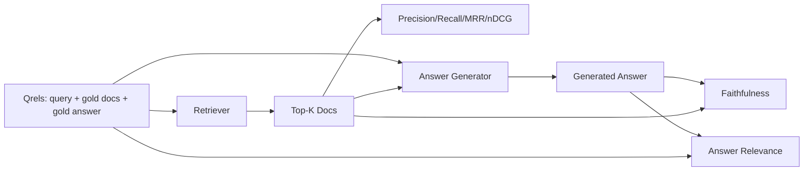

# RAG 评估：精确率、召回率、MRR、nDCG、忠实度、答案相关性

> 如果你不能同时给检索和答案打分，你就不能发布系统。两者不是同一指标，同一提示在不同轴上失败。

**类型：** 构建
**语言：** Python
**前置课程：** 第 11 阶段课程 06（RAG）、10（评估）；第 19 阶段 Track B 基础（课程 20-29）；第 19 阶段课程 64、65、66、67
**时长：** ~90 分钟

## 学习目标
- 从金标准 qrels 计算四个检索指标：precision@k、recall@k、MRR（平均倒数排名）和 nDCG@k。
- 计算两个答案级指标：忠实度（每个声明都有检索上下文支撑）和答案相关性（答案回应了问题）。
- 构建固定 qrels 文件（查询、金标准文档 ID、金标准答案文本），评估端到端读取。
- 阅读指标值诊断流水线在哪里失败：检索、排序、生成还是接地。

## 问题所在

RAG 系统至少有四个活动部件：分块器、检索器、重排器、生成器。任何一个都可能是错误答案的原因。没有分阶段指标，你是在盲飞。

用户报告错误答案。是因为分块器切断了答案区间？是因为检索器没有将块包含在 top-k 中？是因为重排器将正确块推过了位置一？是因为生成器忽略了块并编造了内容？仅从答案无法判断。你需要：

- 检索指标来评估检索器的输出。
- 排序指标来评估正确块在排序中的位置。
- 忠实度来评估生成器是否保持在检索上下文内。
- 答案相关性来评估答案是否回应了问题。

本课程在固定 qrels 文件之上构建全部六个。评估离线且确定性；生产中你将模拟 LLM 评审替换为真实模型调用。

## 核心概念



### Precision@k

检索器返回的 top-k 文档中，有多少比例在金标准集中？如果金标准有三个文档，top-3 返回了其中两个和一个错误的，precision@3 是 2 / 3。当不相关检索块的成本很高时使用精确率（生成器在其上浪费词元，或块毒害答案）。

### Recall@k

金标准文档中，有多少比例在 top-k 中？如果金标准有三个文档，top-5 包含了全部三个，recall@5 是 1.0。当遗漏答案的成本很高时使用召回率（你宁愿多看一个错误块也不愿完全错过答案块）。

生产 RAG 中人们通常引用的指标是 recall@k。生成可以轻松丢弃不相关块；它无法从从未见过的块中发明答案。

### MRR（平均倒数排名）

对每个查询，找到排序列表中第一个相关文档的位置。倒数排名是 1 / 位置。对查询集取均值。MRR 是检索器将最佳答案放在顶部的单数摘要。

MRR 严重加权位置 1。金标准文档在排名 1 的查询贡献 1.0。排名 2 贡献 0.5。排名 10 贡献 0.1。该指标由列表顶部主导。

### nDCG@k

归一化折损累积增益。完整公式为每个检索文档分配增益（通常相关为 1，不相关为 0），按位置的对数折损，求和，再除以理想 DCG（完美排序时的 DCG）。范围 0 到 1。

nDCG 适应分级相关性：金标准可以说"文档 A 是 3，文档 B 是 2，文档 C 是 1"。MRR 和 recall@k 将一切扁平为二值。当语料库中每个查询有多个部分相关文档时使用 nDCG。

### 忠实度

对生成答案中的每个声明，检查该声明是否被检索上下文支撑。标准实现使用 LLM 评审提示，接收（声明，上下文）并返回是或否。指标是通过检查的声明占比。

忠实度捕获生成器发明内容的失败模式。即使检索器返回了正确的块，幻觉的生成器也是坏的。忠实度也称为接地性、支撑性、归因性。

本课程用确定性模拟评审器实现忠实度，检查每个声明的词元是否按阈值与检索上下文重叠。生产中你替换为真实模型调用。指标的形状相同。

### 答案相关性

答案是否实际回应了问题？忠实度问"答案是否基于上下文？"。答案相关性问"答案是否基于问题？"。忠实但偏题的答案在忠实度上得分高，在相关性上得分低。简短、切题但忽略上下文的答案在相关性上得分高，在忠实度上得分低。

标准实现也使用 LLM 评审：取（问题，答案）并问答案是否回应了问题。本课程实现词元重叠加评审替代方案。

## 固定 qrels

```python
{
  "qid": "q1",
  "query": "what is the abort threshold for multipart uploads",
  "gold_doc_ids": ["d1", "d3"],
  "gold_answer_substring": "three failed parts",
  "graded_relevance": {"d1": 3, "d3": 2},
}
```

每个查询携带：
- 查询字符串，
- 一组金标准文档 ID（用于精确率 / 召回率 / MRR），
- 分级相关性字典（用于 nDCG），
- 金标准答案子串（作为每个 qrel 的参考元数据保留；本课程的忠实度通过判断提取的声明与检索上下文来计算，而非与此子串对比）。

生产中你需要标注这些。本课程附带手工构建的固定数据，使评估开箱即用。

## 构建它

`code/main.py` 实现了：

- `precision_at_k(retrieved, gold, k)` - 字面定义。
- `recall_at_k(retrieved, gold, k)` - 字面定义。
- `mean_reciprocal_rank(retrieved_list_of_lists, gold_list)` - 跨查询的均值。
- `ndcg_at_k(retrieved, graded_relevance, k)` - DCG / IDCG，支持二值或分级增益。
- `extract_claims(answer)` - 将答案拆分为句子形状的声明。
- `faithfulness(claims, context_texts, judge)` - 被判定为有支撑的声明占比。
- `answer_relevance(question, answer, judge)` - 评审答案是否回应了问题。
- `MockJudge` - 确定性词元重叠评审器，使评估可离线运行。
- `evaluate_pipeline(pipeline_fn, qrels, ks)` - 运行每个指标的编排器。
- 一个演示，运行三个流水线变体（分块器基线、混合检索、混合 + 重排）对 qrels 并打印指标表格。

运行：

```bash
python3 code/main.py
```

输出在单个指标表格中显示每个变体的 precision@k、recall@k、MRR、nDCG@k、忠实度和答案相关性。混合检索行在召回率上击败分块器基线；重排行在 MRR 上击败混合检索。

## 阅读指标诊断失败

| 症状 | 可能原因 | 修复什么 |
|---------|-------------|-------------|
| 低 recall@k，低 precision@k | 分块器切断了答案或检索器找不到它 | 分块器边界（课程 64）或检索器模态（课程 65） |
| 尚可的 recall@k，低 MRR | 正确块在 top-k 中但不在位置 1 | 重排器（课程 66） |
| 高 MRR，低忠实度 | 生成器在正确上下文下仍发明内容 | 生成提示；强制引用或拒绝 |
| 高忠实度，低相关性 | 答案有根据但偏题 | 查询改写器（课程 67）或生成提示 |
| 四项都高，用户仍抱怨 | 评估集不具代表性 | 用真实用户查询扩展 qrels |

## 演示会隐藏的失败模式

**LLM 评审偏差。** 模型评判自己的输出时比实际更忠实。使用与生成器不同的模型家族作为评审器，或手工评分一个样本。

**Qrels 腐化。** 金标准答案随语料库变化而漂移。2024 年 1 月对 q1 是金标准的文档在 2024 年 10 月不再是正确答案，因为团队重命名了函数。安排季度 qrels 审查。

**忠实度微检查遗漏宏观声明。** 逐句忠实度可以通过，而整体答案的结构误导。在自动化指标之上添加样本级定性审查。

**Recall@k 掩盖每查询失败。** 90% 的平均召回率可以隐藏某个查询类别总是遗漏。按查询类别（字面、改写、多主题）切分 qrels 并报告每切片指标。

## 使用它

生产模式：

- 每次检索器或生成器更改时运行评估。将 recall@k 回退视为测试失败。
- 持久化每个查询的指标追踪。当用户抱怨时，查找匹配的 qrels 条目并看是否会被捕获。
- 分层 qrels：20 个查询的冒烟集在 CI 中运行；200 个的回归集每晚运行；2000 个的深度集每周运行。

## 发布它

课程 69 连接整个流水线（分块器、检索器、重排器、生成器）并对此端到端系统运行评估。

## 练习

1. 添加第五个检索指标：hit-rate@k。与 recall@k 比较。解释它们何时不同。
2. 实现分级忠实度：0（无支撑）、1（部分支撑）、2（完全支撑）。相应更新指标。
3. 用真实模型调用替换模拟评审器。测量模拟与真实评审器在固定数据上的分歧。
4. 添加查询类别切片（"字面"、"改写"、"多主题"）。报告每切片指标。
5. 添加"答案长度"指标并与忠实度相关联。绘制曲线。

## 关键术语

| 术语 | 人们常说的 | 实际含义 |
|------|-----------------|------------------------|
| Precision@k | "检索命中率" | top-k 中金标准的占比 |
| Recall@k | "金标准命中率" | 金标准在 top-k 中的占比 |
| MRR | "首次命中位置" | 第一个相关文档排名倒数的均值 |
| nDCG@k | "分级排序质量" | top-k 的 DCG 除以理想 DCG |
| 忠实度 | "接地性" | 被检索上下文支撑的答案声明占比 |
| 答案相关性 | "它回应了问题吗？" | 答案是否匹配问题的意图 |
| Qrels | "金标准标签" | 标注的查询集及其金标准文档和答案 |

## 延伸阅读

- Buckley, Voorhees, "Evaluating Evaluation Measure Stability", SIGIR 2000 - 排序指标的经典论文
- Jarvelin, Kekalainen, "Cumulated Gain-based Evaluation of IR Techniques" - nDCG 论文
- [Ragas: Automated Evaluation of RAG Pipelines](https://docs.ragas.io)
- [Anthropic, Evaluating RAG](https://www.anthropic.com/news/evaluating-rag)
- 第 11 阶段课程 10 - 评估框架基础
- 第 19 阶段课程 64-67 - 此处评估的组件
- 第 19 阶段课程 69 - 本评估打分的端到端流水线
