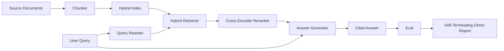

# 端到端 RAG 系统

> 六节课的组件。一条流水线。一个评估循环。一个自终止演示。这就是你要发布的系统。

**类型：** 构建
**语言：** Python
**前置课程：** 第 11 阶段课程 06（RAG）、10（评估）；第 19 阶段 Track B 基础（课程 20-29）；第 19 阶段课程 64、65、66、67、68
**时长：** ~90 分钟

## 学习目标
- 将分块器、混合检索器、查询改写器、交叉编码器重排器和答案生成器组合为单条端到端流水线。
- 实现按块锚点引用声明的答案生成器，带低置信度拒绝回退。
- 对组装的流水线运行课程 68 的评估，证明分阶段构建在每个指标上都优于相同组件的孤立使用。
- 构建自终止 CLI 演示，摄取固定语料库，运行固定查询集，并以摘要报告零退出。

## 问题所在

六个组件孤立存在证明不了什么。分块器可以在语料库上的 recall@5 胜出，但在系统的 recall@5 上失败，因为检索器无法对分块器输出的内容排序。重排器可以在合成候选池上提升 MRR，但在真实双编码器候选上失败，因为双编码器在重排预算处的召回率太低。查询改写器可以在单个查询上提升金标准文档，但在下一个查询上失败，因为 LLM 模拟返回了退化的假设性文档。

集成测试是整个流水线端到端运行，对同一固定 qrels、同一指标、由一个编排文件连接一切。这就是本课程构建的。如果集成流水线上的指标击败每个阶段孤立演示的指标，你就证明了系统。

## 核心概念



### 连接选择

流水线是一个小图。每个阶段是一个具有清晰签名的函数。

| 阶段 | 输入 | 输出 |
|-------|-------|--------|
| 分块器 | 文档文本 | Chunk 记录列表 |
| 检索器 | 查询字符串 | Top-N Chunk 记录 |
| 改写器（可选） | 查询字符串 | 改写列表 + 假设性文档 |
| 重排器 | 查询，候选 | 带交叉分数的 Top-K Chunk 记录 |
| 生成器 | 查询，Top-K Chunk 记录 | 带引用的答案字符串 |

当每个签名稳定时，组合很直接。课程的 `Pipeline` 类持有五个阶段和一个按顺序运行它们的 `query` 方法。每个阶段都可替换：传入不同的分块器、检索器、改写器、重排器或生成器，流水线仍然运行。

### 带引用的答案生成器

生成器是最后阶段，也是最容易出错的。本课程附带一个确定性模拟生成器：

1. 取 top-K 重排块。
2. 选择最多两个与查询内容词元重叠最高的块。
3. 输出答案，是每个所选块一句话的拼接，每句话后跟 `[doc_id:chunk_index]` 锚点。
4. 如果没有块的重叠超过拒绝阈值，输出"我不知道"且不带引用。

生产中你将模拟替换为真实 LLM 调用，使用提示模板：

```
You are answering a question using only the snippets below.
Cite every claim with the anchor in parentheses.
If the snippets do not answer the question, say "I do not know".

Question: {query}

Snippets:
{enumerated chunks with anchors}

Answer:
```

低置信度拒绝路径是记录交叉编码器排名 1 分数的全部原因。如果它低于语料库阈值，生成器拒绝。这是防止幻觉答案的安全阀。

### 自终止演示

演示端到端运行一切。它打印一个查询的分阶段分解，对四个固定 qrels 运行评估，打印指标表格，如果课程 68 的所有指标满足演示中设定的阈值则以状态零退出。如果任何指标低于阈值，演示以非零状态和命名失败指标的消息退出。

这是 CI 冒烟测试的形状。流水线离线、快速、确定性运行。阈值在固定数据上故意设紧，使六节课中任何一节的回归都会导致演示失败。

## 构建它

`code/main.py` 实现了：

- `Chunk` - 贯穿所有阶段的记录（扩展课程 64 的形状，添加 chunk_index 和 source doc_id）。
- `Chunker` - 从课程 64 选择策略（默认递归分割）。
- `HybridIndex` - 打包课程 65 的 BM25 + 稠密 + RRF。
- `Rewriter`（可选）- 按查询长度和连词存在从课程 67 的 HyDE、多查询、分解中选择一种。
- `Reranker` - 课程 66 的训练交叉编码器，使用更小的固定训练集以在几秒内收敛。
- `Generator` - 带引用和低置信度拒绝的确定性模拟生成器。
- `Pipeline` - 用 `query(question)` 方法组合五个阶段，返回 `Result(answer, top_k, latency_ms_per_stage)`。
- `run_demo()` - 摄取语料库，运行三个固定查询，运行评估，打印结果，按阈值设置退出码。

运行：

```bash
python3 code/main.py
```

输出是一个打印的查询追踪、完整评估表格和最终通过/失败状态。在固定数据上返回退出码 0。

## 演示会隐藏的失败模式

**分块器边界漂移。** 如果你在评估 qrels 标注轮次和演示之间切换分块器策略，金标准文档 ID 不再对齐。在 qrels 文件中锁定分块器策略。演示包含命名分块器的头部。

**重排器训练集泄漏到评估中。** 课程 66 的 14 个训练三元组包含与评估查询相似的查询。生产中严格留出评估查询。演示的评估查询与重排训练集故意不相交。

**模拟生成器隐藏幻觉风险。** 模拟不会幻觉，因为它只输出检索块中的文本。课程注明这一点并指向生产替换路径为真实模型。

**无流式输出。** 流水线在每个阶段结束时返回完整答案。生产系统会流式输出生成器的内容。流式输出超出范围；答案级指标在最终字符串上工作，无论哪种方式。

**延迟是离线的。** 模拟 LLM 调用是常数时间。真实 LLM 调用占主导。在请求范围内规划延迟预算；课程的分阶段计时仅测量 CPU 工作。

## 使用它

生产模式：

- 在一个具有显式阶段接口的编排器下发布流水线文件。避免将连接分散在仓库中。
- 在每次触及阶段的合并前运行评估。如果评估下降，合并不落地。
- 持久化每个 CI 运行的指标追踪，以便将回归归因于阶段替换。
- 添加 20 个查询的冒烟集（回归集的子集）在 30 秒内运行；完整回归集每晚运行。

## 发布它

本课程的流水线文件是第 19 阶段 Track F 后续课程假设的形状。后续课程会在此基础上添加摄取自动化、增量重索引、遥测和服务层。检索、重排、改写和评估部分在此完成。

## 练习

1. 在改写器内部添加每查询策略选择器：课程 67 的启发式（长度、连词、术语比率）选择 HyDE、多查询或分解。
2. 在环境标志后为生成器添加真实 LLM 调用。默认使用模拟。测量延迟差异。
3. 扩展演示以接受 `--corpus path` 标志加载真实语料库。重新运行评估和阈值检查。
4. 为分块器添加 `--strategy` 标志。测量每种策略对端到端召回率的贡献。
5. 添加流式生成器接口并将其送入评估。确认忠实度在最终字符串上计算而非流式前缀上。

## 关键术语

| 术语 | 人们常说的 | 实际含义 |
|------|-----------------|------------------------|
| 流水线 | "RAG 流水线" | 从摄取到带引用答案的组合阶段 |
| 引用锚点 | "来源链接" | 附加到每个声明的 (doc_id, chunk_index) 引用 |
| 低置信度拒绝 | "我不知道" | 当重排器 top-1 分数低于阈值时生成器不返回答案 |
| 冒烟集 | "CI 评估" | 在每个 PR 检查中运行的最小 qrels 子集 |
| 阶段接口 | "函数签名" | 每个流水线阶段的稳定输入和输出类型 |

## 延伸阅读

- [Anthropic, Building search and retrieval](https://www.anthropic.com/news/contextual-retrieval)
- [Pinterest, MCP internal search](https://medium.com/pinterest-engineering) - 参考生产架构
- [Ragas: Automated Evaluation of RAG Pipelines](https://docs.ragas.io)
- 第 11 阶段课程 06 - RAG 基础
- 第 19 阶段课程 64-68 - 此处组合的组件
