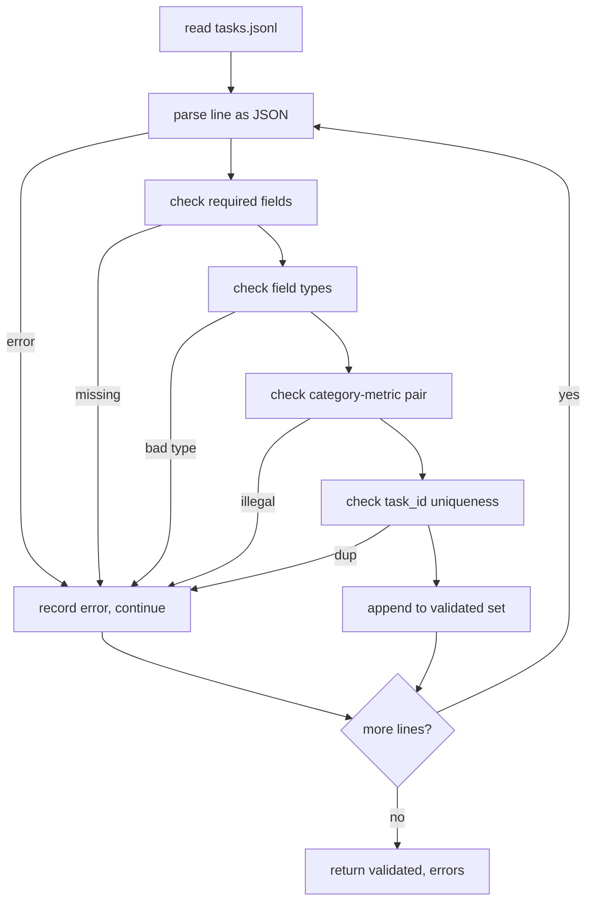

# 任务规格格式

> 评估框架的好坏取决于其任务所遵守的契约。在编写任何评分函数之前，先冻结 JSONL 结构和度量词汇表。

**类型：** Build
**语言：** Python
**前置条件：** Phase 19 Track B 基础
**时间：** ~90 分钟

## 学习目标

- 定义一个 JSONL 任务记录模式，用一个结构覆盖算术、多选题、代码执行、分类和自由文本摘要。
- 锁定一个封闭的度量名称词汇表，使下游课程（71-73）可以根据单个字段进行分发。
- 将少样本示例和后处理规则指定为任务的一部分而非运行器的一部分，使相同的提示在不同模型间产生相同的目标。
- 实现一个严格的验证器，在格式错误的记录到达运行器之前将其拒绝。
- 提供一个 10 任务的测试集，覆盖规格的每个分支，让验证器有真实数据可处理。

## 为什么要冻结规格

研究代码库积累评估脚本的速度比积累测试还快。六个月后，每个 notebook 都有自己的 JSON 结构，每个度量都被实现了两次，没有任何东西可以跨运行比较。修复方法很无聊：选一个模式，写一个验证器，拒绝其他一切。这就是本课所做的事。

这个结构借鉴了 BIG-bench、HELM 和 lm-eval 风格框架的思路，但字段名是我们自己的。每个字段有唯一的拥有者。运行器读取任务。度量读取目标。后处理步骤归一化生成结果。没有字段在管道中途可变。

## 记录结构

一个任务是单行上的一个 JSON 对象。框架读取 `tasks.jsonl` 并独立验证每一行。坏行中止该记录，而非整个运行。

```json
{
  "task_id": "arith_001",
  "category": "arithmetic",
  "prompt": "Compute the result. Question: 17 + 24\nAnswer:",
  "targets": ["41"],
  "metric_name": "exact_match",
  "few_shot_examples": [
    {"prompt": "Question: 2 + 2\nAnswer:", "completion": "4"}
  ],
  "post_process": "strip_whitespace",
  "metadata": {"difficulty": "easy"}
}
```

必填字段为 `task_id`、`category`、`prompt`、`targets`、`metric_name`、`post_process`。`few_shot_examples` 和 `metadata` 为可选。未知顶层字段验证失败。

## 字段规则

`task_id` 是不含空格的字符串。验证器在文件内强制唯一性。

`category` 是 `arithmetic`、`mcq`、`code_exec`、`classification`、`summary` 之一。类别约束了哪些度量和后处理配对是合法的。`code_exec` 任务必须使用 `metric_name = code_exec`，`mcq` 任务必须使用 `metric_name = exact_match` 且目标为单字母。

`prompt` 是非空字符串。验证器禁止尾部空白，并拒绝提示体中已包含少样本块的记录。少样本渲染发生在运行器中，而非作者处。

`targets` 是非空字符串列表。对于 `exact_match`，匹配任一元素即算通过。对于 `f1` 和 `rouge_l`，取最高分的目标。对于 `mcq`，列表恰好包含一个元素。

`metric_name` 是 `exact_match`、`f1`、`bleu_4`、`rouge_l`、`accuracy`、`code_exec` 之一。词汇表是封闭的。新度量需要新课程和新条目。

`few_shot_examples` 是 `{prompt, completion}` 对的列表。验证器将列表上限设为八条，以保持提示有界。

`post_process` 是 `none`、`strip_whitespace`、`lower`、`extract_letter`、`extract_code_block`、`extract_first_line` 之一。每条规则有单一确定性行为。验证器禁止组合规则。

## 验证器行为



验证器返回两个列表：已验证记录和错误记录，错误记录包含出错的行、违反的规则和故障字段。除非设置了显式的 `--allow-bad-tasks` 标志，否则运行器在错误列表非空时拒绝启动。

## 少样本渲染

运行器将少样本示例拼接在提示前面，以空行分隔。同一条代码路径为每个模型运行，因此唯一的方差来源是模型本身。作者只需编写一次示例，而非每个提供商一次。

```python
def render(task):
    parts = []
    for ex in task.get("few_shot_examples", []):
        parts.append(ex["prompt"] + " " + ex["completion"])
    parts.append(task["prompt"])
    return "\n\n".join(parts)
```

## 后处理规则

后处理步骤在生成之后、度量之前运行。它是确定性的且无状态的。

- `none` 返回原字符串不变。
- `strip_whitespace` 去除首尾空白。
- `lower` 将字符串转为小写。
- `extract_letter` 返回匹配 `[A-E]` 的第一个字符，用于多选题。
- `extract_code_block` 返回第一个三反引号围栏代码块的正文，用于代码执行。
- `extract_first_line` 返回第一个非空行，用于摘要分类。

需要此列表之外规则的任务属于新课程。

## 本课不做的事

本课不做评分。本课不调用模型。本课不运行代码。这些在课程 71、72 和 75 中。本课冻结的是它们全部遵守的契约。

10 任务的测试集包含两道算术题、两道多选题、两道代码执行题、两道分类题和两道摘要题。验证器通过全部 10 条。另一个测试集（`tasks_bad.jsonl`）触发每条规则，验证器返回恰好对应数量的错误。

## 如何阅读代码

`main.py` 定义了 `TaskSpec`、`validate_task`、`validate_file` 和一个 CLI 入口。测试集加载器是 `load_fixtures`。渲染和后处理辅助函数紧挨着验证代码，这样课程 75 的运行器只需导入一个模块。

从头到尾阅读 `main.py`。然后阅读 `code/tests/test_spec.py`。测试固定了每条验证规则和每个后处理行为。`main.py` 底部的演示验证了捆绑的测试集并打印摘要。

## 延伸阅读

真正的评估套件增长类别的方式就像数据库模式增长列一样。明智的做法是拒绝添加类别，除非同时添加一个度量、一个后处理规则和至少一个测试任务。把规格当作数据库迁移来对待。每次变更都要经过审查、版本化，并附带测试。本课的验证器就是那道门。
