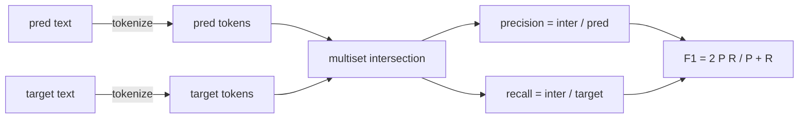
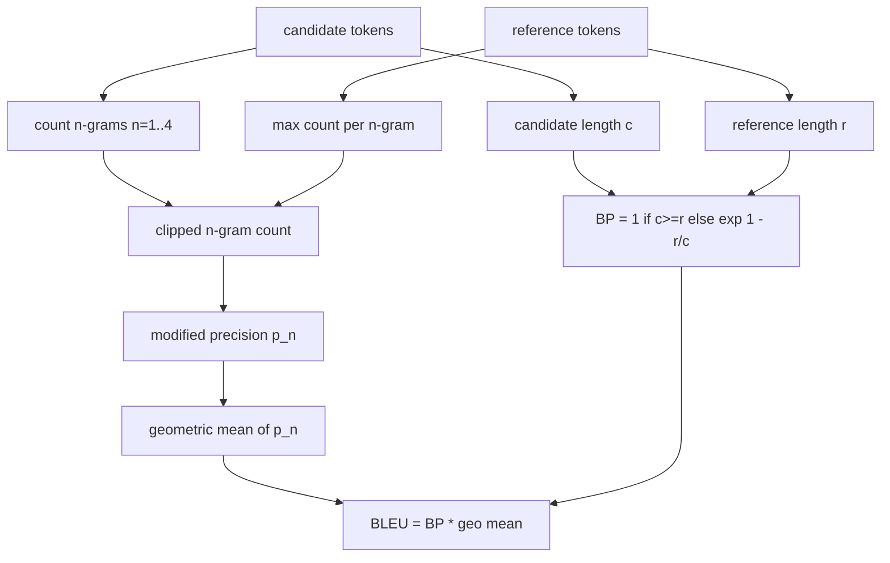

# 经典度量

> BLEU、ROUGE-L、F1、精确匹配、准确率。这五个度量仍然占据了大多数已发表的 LLM 评估数据。从第一性原理实现每一个，这样你就知道这个数字意味着什么。

**类型：** Build
**语言：** Python
**前置条件：** Phase 19 Track B 基础，课程 70
**时间：** ~90 分钟

## 学习目标

- 实现带显式分词规则的 token 级精确匹配、F1 和准确率。
- 从头实现 BLEU-4：修改版 n-gram 精度、n 等于 1 到 4 的几何均值、简短惩罚。
- 使用最长公共子序列实现 ROUGE-L，结合精确率和召回率的 F-beta 组合。
- 根据课程 70 的 `metric_name` 字段进行分发，使运行器保持度量无关。
- 用来自手工计算的参考向量固定行为，而非来自第三方库。

## 为什么要重新实现

你会读到报告 BLEU 28.3 的论文，也会读到报告 BLEU 0.283 的论文。你会发现两个库的 ROUGE-L 分数相差十分，因为一个截断为小写而另一个不这样做。停止困惑的最快方法是自己写度量，然后指出分词器在哪一行决定、平滑在哪一行应用。之后，跨论文比较数字就变成了阅读度量设置的问题，而非争论库的问题。

标准库加 numpy 就够了。BLEU 就是计数和一个钳位。ROUGE-L 就是动态规划。F1 就是 token 上的集合交集。最难的部分是选择一个分词器并坚持使用它。

## 分词

分词器是 `re.findall(r"\w+", text.lower())`。小写、字母数字序列、丢弃标点。本课的每个度量都使用这个完全相同的分词器。运行器无权选择。如果你换了分词器，你就在运行一个不同的基准。

```python
TOKEN_RE = re.compile(r"\w+", re.UNICODE)
def tokenize(text):
    return TOKEN_RE.findall(text.lower())
```

这是刻意的简化。生产环境会关心 CJK 字符、缩写和代码标识符。本课的要点是分词器是一个契约，而非一个旋钮。

## 精确匹配

```python
def exact_match(pred, targets):
    return float(any(pred.strip() == t.strip() for t in targets))
```

每个任务返回 1.0 或 0.0。数据集上的聚合值是均值。这是算术、多选题和短分类任务的主力度量。

## Token 级 F1

为预测和目标建立 token 多重集。精确率是多重集交集除以预测的多重集。召回率是同一交集除以目标的多重集。F1 是调和均值。实现处理了空预测和空目标的边界情况。



对于多目标任务，我们取目标列表中的最佳 F1。这匹配了文献中广泛报告的 SQuAD 风格行为。

## BLEU-4

BLEU 是经典的机器翻译度量，在摘要工作中仍然出现。我们使用的公式是带有标准简短惩罚和加一平滑的语料级 BLEU-4，应用于修改版 n-gram 计数，这样单个缺失的 4-gram 不会将分数推至零。

对于每个候选-参考对，我们计算 n 等于 1、2、3、4 的修改版 n-gram 精度。修改版精度将候选 n-gram 计数裁剪为该 n-gram 在任何参考中的最大计数，因此候选不能通过重复一个短语来膨胀。四个精度的几何均值由简短惩罚包裹。



平滑规则是 Lin 和 Och 所称的方法 1：在取对数之前，对每个 n-gram 精度的分子和分母各加一。这避免了当参考没有匹配的 4-gram 时出现 `log 0`，并且在长候选上保持接近未平滑的值。

## ROUGE-L

ROUGE-L 比较候选和参考 token 序列的最长公共子序列。LCS 在不强制连续性的情况下捕获词序，这就是它是默认摘要度量的原因。我们用标准动态规划表计算 LCS 长度，然后推导召回率为 `lcs / 参考长度`、精确率为 `lcs / 候选长度`，并用 F-beta 组合，其中 beta 等于一，即对称的 F1 形式。

```python
def lcs_length(a, b):
    n, m = len(a), len(b)
    dp = numpy.zeros((n + 1, m + 1), dtype=int)
    for i in range(n):
        for j in range(m):
            if a[i] == b[j]:
                dp[i+1, j+1] = dp[i, j] + 1
            else:
                dp[i+1, j+1] = max(dp[i+1, j], dp[i, j+1])
    return int(dp[n, m])
```

numpy 表使实现清晰可读；纯 Python 列表也可以。选择 ROUGE-L 的任务每个任务付出 O(n m) 的代价。对于典型的摘要长度，这保持在一毫秒以内。

## 准确率

对于多目标分类任务，准确率归结为对单个归一化目标的精确匹配。我们将其暴露为单独的函数，这样分发器可以根据 `metric_name` 分发，而无需在运行器内部进行字符串比较。

## 分发契约

单一入口点是 `score(metric_name, prediction, targets)`。它返回 `[0, 1]` 中的浮点数。运行器不对度量名称做分支。它移交调用并写入结果。这是课程 75 将与课程 70 的任务规格对接的接口。

```python
def score(metric_name, pred, targets):
    if metric_name == "exact_match":
        return exact_match(pred, targets)
    if metric_name == "f1":
        return max(f1_score(pred, t) for t in targets)
    if metric_name == "bleu_4":
        return max(bleu4(pred, t) for t in targets)
    if metric_name == "rouge_l":
        return max(rouge_l(pred, t) for t in targets)
    if metric_name == "accuracy":
        return accuracy(pred, targets)
    raise ValueError(f"unknown metric_name: {metric_name}")
```

`code_exec` 在课程 72 中处理，并在那里插入分发器。

## 本课不做的事

本课不调用模型。本课不做课程 70 的后处理规则之外的生成归一化。本课不计算置信区间。本课不做 BLEURT 或 BERTScore（那些需要模型，属于不同的课程）。重点是基础：五个度量、一个分词器、一个分发表。

## 如何阅读代码

`main.py` 将每个度量定义为自由函数加上分发器。参考向量位于文件底部的 `_reference_examples` 块中。演示对八个示例运行分发器并打印每个度量的分数。`code/tests/test_metrics.py` 中的测试固定了参考向量并压测每个边界情况（空预测、空参考、无共享 token、精确匹配、重复短语裁剪）。

从头到尾阅读 `main.py`。函数按复杂度排序。exact_match 和 accuracy 各一行。F1 六行。BLEU 和 ROUGE-L 是重头部分，包含平滑规则和 LCS 递推的详细注释。

## 延伸阅读

经典度量是必要的，但不是充分的。它们奖励表面重叠而忽略语义。修复方法是在经典基础之上叠加基于模型的度量（BLEURT、BERTScore、GEval），一旦你信任经典基础。那是后续课程的事。现在：让这五个工作，用测试固定它们，你就拥有了一个可审计、快速且可复现的度量栈。
