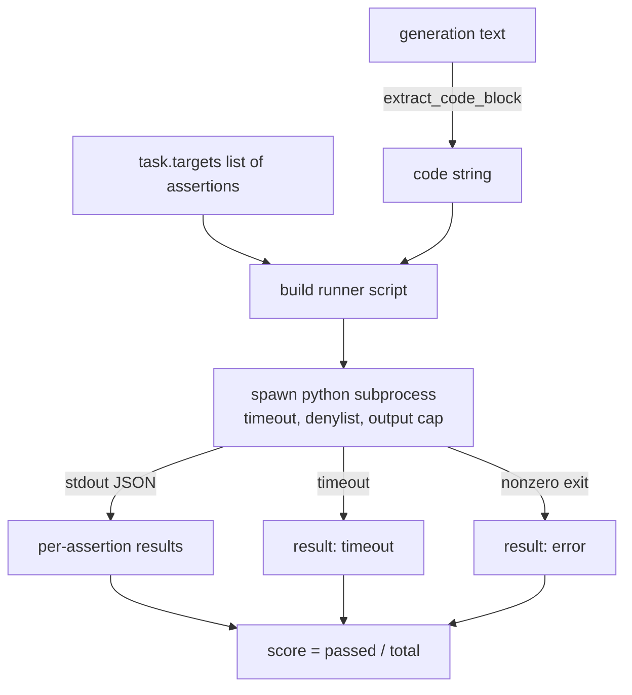
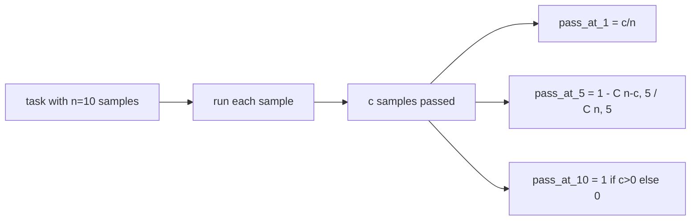

# 代码执行度量

> 生成的代码通过测试时才是正确的。评估框架必须提取代码、在不崩溃宿主的情况下运行它，并诚实地统计通过率。本课构建这个接口。

**类型：** Build
**语言：** Python
**前置条件：** Phase 19 Track B 基础，课程 70 和 71
**时间：** ~90 分钟

## 学习目标

- 以匹配课程 70 后处理规则的方式，从自由格式生成中提取代码块。
- 在隔离的子进程中执行候选代码，配备挂钟超时、输出上限和导入拒绝列表。
- 将任务评分计算为所提供的断言字符串中通过的比例。
- 为从一个模型采样多个生成的任务计算 pass-at-k。
- 将沙箱崩溃、语法错误和超时视为具有不同退出代码的一等失败模式，运行器可以记录。

## 为什么要用隔离子进程

内联 `exec` 是安全和稳定性的隐患。生成的 `while True: pass` 会永远阻塞评估。生成的 `import shutil; shutil.rmtree('/')` 和听起来一样灾难性。修复方法是为每个候选生成一个新的 Python 解释器，通过 stdin 传递代码，将断言结果写入 stdout，如果超时就终止进程。宿主评估进程继续运行。

真正的评估如 HumanEval、MBPP、BigCodeBench 和 LiveCodeBench 都使用子进程沙箱。有些在上面叠加 Docker。我们停在子进程是有原因的：它是可移植的，它是标准库，它捕获了教育评估中重要的失败模式。生产部署添加 seccomp、网络隔离和只读文件系统。关于加固的下一课在本轨道之外。

## 代码执行任务的形状

`code_exec` 任务在 `targets` 中携带断言字符串。运行器从生成中提取围栏代码块，围绕它构建测试框架，并运行结果。



分数是 `[0, 1]` 中的比例。一个有三条断言、通过两条的任务得 0.667。无论什么失败，运行器返回相同的结构：子进程崩溃被映射到归一化的错误代码，而非冒泡到框架的 Python 回溯。

## 拒绝列表

拒绝列表基于导入。在运行候选代码之前，运行器脚本将危险模块的导入重写为抛出 `ImportError("denied")` 的存根。列表刻意保守：`os.system`、`subprocess`、`socket`、`requests`、`urllib`、`urllib.request`、`urllib.error`、`urllib.parse`、`ctypes`、`shutil`、`http.client`、`asyncio.subprocess`。

我们不假装这是万无一失的。有决心的对抗性代码可以逃逸任何 Python 进程内沙箱。拒绝列表是一个后盾。挂钟超时和输出上限才是承重控制。

```python
DENIED = {
    "os.system": True,
    "subprocess": True,
    "socket": True,
    "shutil": True,
    "requests": True,
    "urllib": True,
    "ctypes": True,
}
```

我们通过在前面添加 `import sys` 和一个将 `os.system` 猴子补丁为抛出异常的守卫来包装候选代码。完整模板在 `main.py` 中。

## 挂钟超时

每个子进程获得默认三秒挂钟预算。运行器使用 `subprocess.run(..., timeout=t)`。如果超时触发，运行器捕获 `TimeoutExpired`，终止进程，并为该任务记录 `timeout` 退出原因。该任务的分数为零。运行器继续前进。

超时可通过 `task.metadata.timeout_s` 按任务配置。长时间运行的单元测试可以申请更多；课程 70 的验证器将值上限设为三十秒以保持测试集有界。

## 输出上限

子进程可能淹没 stdout，耗尽宿主内存。运行器将 stdout 流式传输到缓冲区，一旦运行总量超过 256 KB 就终止子进程。结果记录为 `exit_code = error`，详情字符串为 `"output overflow"`。这在生成意外写入无限打印循环时会出现。

## Pass-at-k

Pass-at-k 是 HumanEval 等使用的无偏估计量。给定每个任务 `n` 个独立样本，其中 `c` 个通过，从 `n` 中取大小为 `k` 的样本包含至少一个通过解的概率为：

```
pass_at_k(n, c, k) = 1 - C(n - c, k) / C(n, k)
```

当 `n - c < k` 时分子未定义，值为 `1`。实现直接处理边界情况。我们暴露 `pass_at_k(n, c, k)` 供课程 74 的排行榜层使用。



## 退出代码

运行器为每个任务返回五种结果之一：

- `pass` 当每条断言都通过。
- `assertion_fail` 当代码运行但至少一条断言失败。
- `syntax_error` 当代码无法导入或有 SyntaxError。
- `timeout` 当挂钟到期。
- `error` 用于任何其他崩溃，包括拒绝列表命中和输出溢出（溢出以详情 `"output overflow"` 呈现）。

分数仍然是比例。退出代码是元数据。下游课程可以决定是将超时计为零还是缺失数据。

## 本课不做的事

本课不给你真正的沙箱。本课不运行来自开放网络的不可信代码。本课不处理有状态任务如文件 I/O 或网络调用。那些需要容器或 microVM。本课的要点是契约：隔离子进程、拒绝列表、超时、输出上限、干净的退出代码词汇表和 pass-at-k 数学。

## 如何阅读代码

`main.py` 定义了 `extract_code`、`run_candidate`、`score_code_exec` 和 `pass_at_k`。子进程运行器脚本作为字符串构建，通过 `-c` 传递给新的 Python 解释器。`code/tests/test_exec.py` 中的测试覆盖四种退出代码以及针对 HumanEval 风格手工示例的 pass-at-k。

从头到尾阅读 `main.py`。运行器模板是承重部分。仔细审视断言循环，直到你能预测它写回父进程的 JSON 信封。

## 延伸阅读

一旦子进程结构可行，下一个关注点是可移植性。不同的 Python 版本在 Windows 上处理 SIGKILL 的方式不同。最干净的修复是将运行器放入 Docker 镜像。之后是将断言字符串替换为真正的单元测试文件，使评估匹配生产 CI 的做法。到那时不要再把断言字符串叫做测试；它们是玩具测试，有玩具失败模式。
