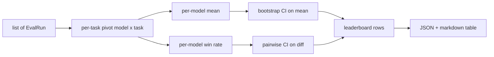
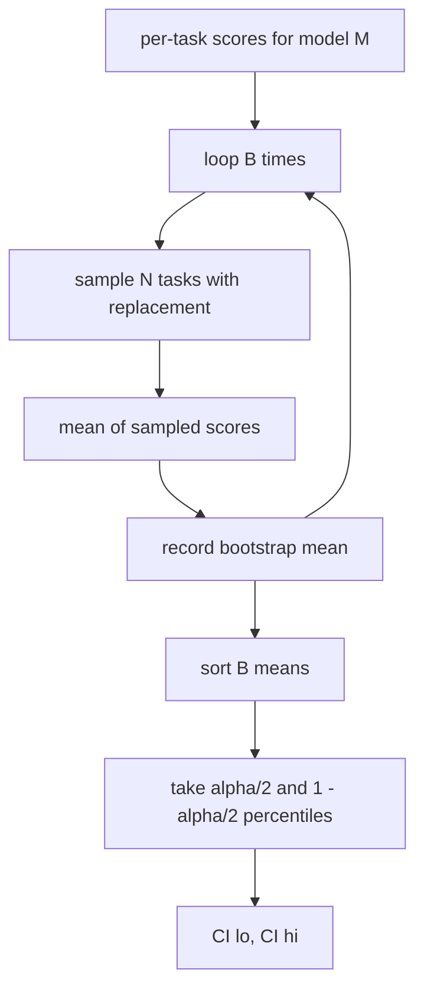

# 排行榜聚合

> 每任务分数很简单。跨异构任务的每模型排名更难。千预测排行榜上的统计显著性是每个人都跳过的部分。本课不跳过。

**类型：** Build
**语言：** Python
**前置条件：** Phase 19 Track B 基础，课程 70、71、73
**时间：** ~90 分钟

## 学习目标

- 将多个模型和多个任务的每任务分数聚合为整洁的每模型行。
- 归一化异构分数，使通过率和 BLEU 值不会过度影响聚合。
- 按均值和胜率对模型排名，并解释何时使用哪种摘要。
- 计算每模型均值和成对差异上的自助法置信区间。
- 将排行榜输出为 JSON 报告和 markdown 表格，课程 75 的运行器可以粘贴到 CI 评论中。

## 输入的形状

聚合器消费一个 `EvalRun` 记录列表：

```python
@dataclass
class EvalRun:
    model_id: str
    task_id: str
    metric_name: str
    score: float          # in [0, 1]
    category: str
```

课程 75 的运行器为每个 `(model, task)` 对发出一条记录。聚合器不关心分数是如何产生的。它期望归一化已经完成：每个分数都在 `[0, 1]` 中。

## 输出

输出三张表：



排行榜行包含：`model_id`、`mean_score`、`mean_ci_lo`、`mean_ci_hi`、`win_rate`、`tasks_completed` 以及可选的 `categories` 映射用于每类别均值。

## 归一化

如果一个任务分数在 `[0, 1]`，另一个在 `[0, 100]`，后者会悄悄主导均值。聚合器验证每个输入分数位于 `[0, 1]`，否则拒绝运行。修复在上游：度量应该已经返回比例。课程 71 到 73 强制执行该契约。

## 均值与胜率

两种排名方案服务于不同目标。

均值分数是一个模型每任务分数的平均值。这是排行榜报告的标题数字。它对异常值和任务不平衡敏感。

胜率计算一个模型在同一任务上击败其他所有模型的频率。对于每个任务，分数最高的模型获胜（平局分摊）。胜率等于获胜次数除以该模型有分数的任务数。它对异常值和尺度差异不太敏感，但会丢失信息。

```python
def win_rate(model_id, runs_by_task, all_models):
    wins, total = 0, 0
    for task_id, runs in runs_by_task.items():
        scores = {r.model_id: r.score for r in runs if r.model_id in all_models}
        if model_id not in scores:
            continue
        total += 1
        best = max(scores.values())
        if scores[model_id] >= best:
            wins += 1
    return wins / total if total else 0.0
```

框架两者都报告。课程 75 的运行器默认按均值排名；胜率的 markdown 列就在那里，以防用户更喜欢它。

## 自助法置信区间

每模型均值附带通过任务上的自助法重采样估计的置信区间。我们有放回地重采样任务 ID，计算重采样集上的均值，重复 `B` 次，取 `alpha` 水平的百分位区间。



对于成对比较，我们自助法计算每任务差异 `score_A - score_B`，取百分位区间并报告。用户读出区间是否排除零。如果是，差异在 alpha 水平上显著。如果不是，排行榜将模型视为平局。

底层辅助函数（`bootstrap_mean_ci`、`bootstrap_pairwise_diff`）默认 `B=1000`；公共聚合器（`aggregate`、`pairwise_diffs`）默认 `b=500`，使演示和测试保持快速。默认 alpha 为 0.05。本课保持自助法纯 numpy，不使用 scipy。

## 类别

如果设置了 `EvalRun.category`，聚合器还报告每类别均值。这是每个排行榜上写着 `math`、`reasoning`、`code`、`safety` 的列。它让运行器发现一个模型总体不错但在代码上较弱，这是标题均值隐藏的信息。

## Markdown 渲染

排行榜渲染为 markdown 表格：

```text
| Rank | Model | Mean | 95% CI | Win rate | Tasks |
|------|-------|------|--------|----------|-------|
| 1    | gpt   | 0.78 | 0.74-0.82 | 0.62 | 50 |
| 2    | claude| 0.75 | 0.71-0.79 | 0.34 | 50 |
| 3    | random| 0.10 | 0.07-0.13 | 0.04 | 50 |
```

表格按均值分数排序。CI 渲染到两位小数。长模型 ID 截断为二十个字符。

## 本课不做的事

本课不运行模型。本课不调用度量层。本课不实现自适应 ECE 或其他校准变体；那些在课程 73。本课不实现任务加权。这里每个任务权重相同。生产排行榜加权任务；我们通过 `weight` 字段留了钩子但在聚合器中忽略它。如果需要，在后续课程中添加加权。

## 如何阅读代码

`main.py` 定义了 `EvalRun`、`LeaderboardRow`、`aggregate`、`bootstrap_mean_ci`、`bootstrap_pairwise_diff` 和 `render_markdown`。演示构建了一个三个模型和十二个任务的合成测试集，聚合并打印排行榜加上成对差异表。`code/tests/test_leaderboard.py` 中的测试固定了自助法、markdown 渲染、胜率边界情况和空输入行为。

从头到尾阅读 `main.py`。数据结构（EvalRun、LeaderboardRow）在前，聚合器其次，自助法第三，渲染最后。每个函数都有聚焦的契约。

## 延伸阅读

自然的下一步是配对任务显著性而非非配对自助法。如果模型 A 和 B 都运行了相同的一百个任务，合适的测试是任务逐差异上的配对自助法，我们已经实现了。再往后，你想要一个尊重任务族（数学问题之间并非独立；一个算术错误模式影响其中十个）的层次自助法。那是后续的事。本课的要点是把基础做对，使评估报告一个你可以捍卫的数字。
