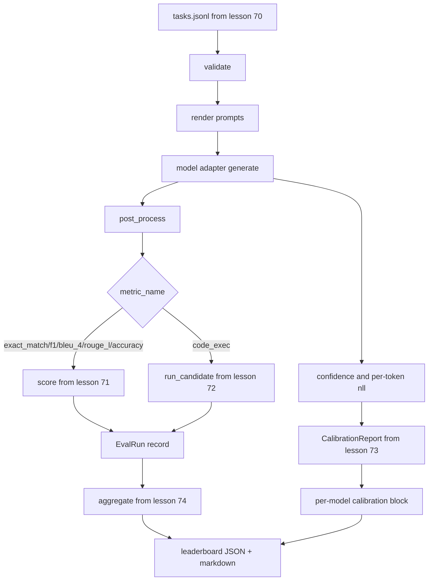

# 端到端评估运行器

> 五课的管道，一课来粘合。运行器读取课程 70 的任务规格，通过适配器调用模型，用课程 71 和 72 评分，附加课程 73 的校准报告，并发出课程 74 的排行榜。演示自终止。

**类型：** Build
**语言：** Python
**前置条件：** Phase 19 Track B 基础，课程 70 到 74
**时间：** ~90 分钟

## 学习目标

- 定义一个 `ModelAdapter` 接口，任何模型（模拟、本地、API）都可以用小方法面满足。
- 在工作池上并行执行任务，对 fixture JSONL 文件运行评估。
- 在一次遍历中组合度量层（exact_match、F1、BLEU-4、ROUGE-L、code_exec）与校准层。
- 发出每模型的 `EvalRun` 记录并直接送入排行榜聚合器。
- 同时输出 JSON 报告和 markdown 表格；干净运行时以退出码零自终止，验证或运行时失败时非零。

## 管道



运行器是集成点。课程 70 到 74 各自拥有一个模块，运行器将它们组合。运行器不重复那些模块中的任何逻辑：它导入它们。

## 适配器接口

适配器是运行器与任何模型之间的接缝。接口刻意很小。

```python
class ModelAdapter:
    model_id: str

    def generate(self, prompt: str, task: TaskSpec) -> Generation: ...
```

`Generation` 是一个数据类，包含：

- `text`：模型的自由格式输出
- `confidence`：`[0, 1]` 中的浮点数，表示模型对答案的自报告概率
- `token_nll`：可选的生成 token 上的负对数似然之和
- `token_count`：可选的生成 token 数量

运行器中的模拟适配器提供三种风格：`RuleBasedAdapter`（确定性、近乎完美）、`NoisyAdapter`（过度自信、经常出错）和 `BiasedAdapter`（擅长一个类别、在另一个类别很差）。演示在课程 70 的测试集上运行全部三个。

## 并行执行

运行器使用 `concurrent.futures.ThreadPoolExecutor` 按模型并行运行任务。工作数默认为八和任务数中的较小值。线程足够，因为真实模型调用的瓶颈是网络 I/O。代码执行路径在任务内部生成自己的子进程，执行器只调度等待。

对于确定性测试，运行器暴露 `run_eval(adapters, tasks, parallel=False)`，使测试可以固定执行顺序。

## 单遍评分循环

对于每个任务：

1. 渲染提示（少样本前缀加提示体）。
2. 调用适配器并计时。
3. 按任务规则后处理生成结果。
4. 分发到度量层。
5. 构建带有分数和度量元数据的 `EvalRun` 记录。
6. 将 `(confidence, correct)` 对追加到校准缓冲区。

`correct` 信号对于 exact_match 风格度量（`exact_match`、`accuracy`、`code_exec`）为 `score >= 1.0`，对于分级度量为 `score >= 0.5`。阈值位于 `_correct_from_score` 中，运行器不暴露公共覆盖。

## 聚合

每个任务都有结果后，运行器调用课程 74 的 `aggregate` 和 `pairwise_diffs` 以及课程 73 的 `CalibrationReport.from_predictions`。输出是单个 JSON 信封：

```json
{
  "leaderboard": [...],
  "pairwise": [...],
  "calibration": {
    "model_id_a": {"ece": 0.04, "brier": 0.10, "populated_bins": 8, ...},
    ...
  },
  "summary": {
    "tasks": 10,
    "models": 3,
    "wall_seconds": 1.2
  }
}
```

运行器还将 markdown 表格写入 stdout，以便用户可以将结果粘贴到 PR 审查中。

## 自终止演示

演示在课程 70 的十个测试任务上运行三个模拟适配器。挂钟时间应在十秒以内。干净运行时退出码为零。

干净运行的标准是：

- 每个任务在课程 70 下验证通过。
- 每个任务在课程 71 和 72 下评分通过。
- 校准报告在课程 73 下聚合无错误。
- 排行榜将基于规则的适配器严格排在随机适配器之上。

如果其中任何一条不满足，运行器以非零退出码退出，JSON 信封中包含结构化错误。

## 本课不做的事

本课不调用真实模型。本课不实现 API 密钥流程或速率限制处理。本课不实现流式或部分生成；适配器每次调用返回一个生成结果。本课不做重试或缓存。这些关注点在适配器层；运行器是度量无关和提供商无关的。

## 如何阅读代码

`main.py` 是集成代码。它通过一个小的 `_load_sibling` 辅助函数从其他五个课程模块导入，该函数通过相对路径解析它们。数据类 `Generation`、`EvalReport` 和 `ModelAdapter` 在本地定义。模拟适配器在文件底部。

从头到尾阅读 `main.py`。略读导入，然后看 `run_eval`，然后是 `_score_one`，然后是适配器。末尾的演示是入口点。

`code/tests/test_runner.py` 中的测试固定了适配器接口、单遍循环、并行与顺序等价性、校准缓冲区和 JSON 信封形状。

## 延伸阅读

这个运行器是基础。生产评估系统添加：以 `(task_id, model_id, model_version)` 为键的结果缓存、跟踪每次运行的美元和 token 的成本账本、在速率限制上退避的重试层、pass-at-k 任务的采样策略，以及长测试集的流式输出格式。每一个都是围绕运行器包装而不改变度量或聚合层的单一关注点。这种分离就是契约的意义所在。

在模拟适配器工作后，为真实提供商添加适配器。选一个有免费层的，写三十行胶水代码，看排行榜亮起来。然后添加第二个提供商，让框架做工作。
