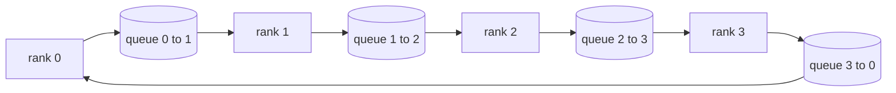

# 集合通信原语从零实现

> 支撑分布式训练的四个集合通信操作是 allreduce、broadcast、allgather 和 reduce_scatter。训练框架提供的所有其他原语都是它们的封装。在 `multiprocessing.Queue` 网格上构建它们一次，与参考实现进行验证，本轨道的其余部分就是管道工程了。

**类型：** 构建
**语言：** Python
**前置课程：** 第19阶段 C 轨道 第42-49课
**时长：** ~90 分钟

## 学习目标

- 实现两遍环 allreduce（先 reduce-scatter 再 allgather），并证明每个 rank 的通信量为每个元素 2(N-1)/N 字节。
- 在 `multiprocessing.Queue` 的点对点发送之上构建 broadcast、allgather 和 reduce_scatter。
- 将每个原语与 `torch.distributed` gloo 后端在相同输入下的参考实现进行验证。
- 根据集群形态、延迟下限和带宽上限，论证选择环拓扑还是树拓扑。

## 问题所在

朴素 allreduce 在 N 个 rank 上向根节点发送 N 倍张量，再广播 N 次回来。每个 rank 的带宽按 O(N) 缩放，根节点成为瓶颈，时钟下限是最慢链路乘以 N。环 allreduce 将其压缩为 2(N-1) 个大小为 T/N 的块，因此每个 rank 的字节数降至 2T(N-1)/N，与集群规模无关。树 allreduce 在小 N 和高延迟链路上胜出，因为深度是 log2(N) 跳而非 2(N-1)。为集群形态选错拓扑，最慢的 GPU 就决定了步时间。

你在本轨道中读到的每个分布式训练框架都依赖这四个原语。PyTorch DDP 用每个参数桶的一次 allreduce 同步梯度。ZeRO 通过 reduce_scatter 分片优化器状态，通过 allgather 广播更新后的参数。FSDP 将完整前向传播变为 allgather 加 reduce_scatter。流水线并行需要 broadcast 在阶段组之间传递激活。如果你无法实现这四个集合通信操作，你就无法分析训练为何卡住、为何梯度不匹配出现在 rank 3、或者为何切换拓扑后流水线气泡翻倍。

## 核心概念



### 两遍环 allreduce

将张量分成 N 个等大块，索引为 0..N-1。每个 rank 拥有等于其 rank 编号的块索引。第一遍，reduce-scatter，运行 N-1 步。在第 s 步，rank r 将块 (r - s) mod N 发送给 rank (r + 1) mod N，并从 rank (r - 1) mod N 接收块 (r - s - 1) mod N，将接收的块累加到本地副本。N-1 步后，rank r 拥有块 r 的完整和。第二遍，allgather，再运行 N-1 步，将完成的块沿环旋转直到每个 rank 持有每个块的完整和。

| 原语 | 每 rank 字节数 | 步数 | 何时使用 |
|-----------|---------------|-------|-------------|
| 环 allreduce | 2T(N-1)/N | 2(N-1) | 大 T，宽带同构集群 |
| 树 allreduce | T log2(N) | 2 log2(N) | 小 T 或高延迟链路 |
| Broadcast | T | log2(N) 树 | 参数初始化，标量配置 |
| Allgather | T(N-1)/N | N-1 | 分片前向，ZeRO 反分片 |
| Reduce_scatter | T(N-1)/N | N-1 | ZeRO 梯度分片 |

### Queue 网格作为 NCCL 的替代

NCCL 运行在 PCIe 和 NVLink 上，具有硬件卸载的归约。在 CPU 上你没有这些。每条环边一个 `multiprocessing.Queue` 给你有序的点对点交付，单生产者单消费者。归约在用户空间进行，所以你付出 Python 开销，但线路模式与 NCCL 环 allreduce 完全相同。在 queue 版本上推理正确性，集群行为自然成立。

### 对照 gloo 验证

每个原语都配有单元测试，将输出与 `torch.distributed` 在相同张量、相同 world size 下使用 gloo 后端的结果进行比较。如果你的环 allreduce 与 gloo 的偏差超过 float32 epsilon，测试失败。对照参考实现验证是不可妥协的；没有它，原语看起来正确直到真实训练运行的第 10000 步才暴露问题。

## 构建它

`code/main.py` 实现了：

- `Mesh` 类，将 N 个 `multiprocessing.Queue` 实例连接成环，暴露每个 rank 的 `send(dst, tensor)` 和 `recv(src)`。
- `ring_allreduce(mesh, rank, world_size, tensor)` 运行两遍算法。
- `broadcast(mesh, rank, world_size, tensor, src)` 基于对数树。
- `allgather(mesh, rank, world_size, tensor)` 使用 N-1 次旋转。
- `reduce_scatter(mesh, rank, world_size, tensor)` 作为 allreduce 的前半部分。
- `_gloo_reference(op, world_size, tensor)` 将相同输入通过 `torch.distributed` 的 gloo 后端运行以进行字节级比较。

运行：

```bash
python3 code/main.py
```

输出：每个原语的验证表，比较 queue 网格和 gloo 输出，以及证明 2T(N-1)/N 缩放的每 rank 字节计数器。

## 生产中的模式

三种模式使原语足够健壮以投入生产。

**在 allreduce 之前将梯度分桶。** 一个 10 亿参数的模型有数万个梯度张量。每个张量一次 allreduce 要付出 N 次延迟下限。DDP 将梯度分入约 25 MB 的桶，每个桶发起一次 allreduce；小张量搭大张量的便车。不分桶的话延迟开销主导步时间。

**通信与计算重叠。** 反向传播按逆序逐层计算梯度。最后一层梯度就绪的那一刻，启动其 allreduce，同时下一层继续计算。PyTorch DDP 通过桶就绪钩子实现这一点。当网络有余量时，重叠可将可见通信时间减半。

**按消息大小选择环或树，而非信仰。** NCCL 附带拓扑检测器，对大于约 1 MB 的消息选择环，小于 1 MB 的选择树。交叉点是带宽与延迟的权衡：超过 1 MB，带宽项 2T(N-1)/N 主导，环胜出；低于 1 MB，log2(N) 跳数胜出。硬编码一种拓扑会在错误的消息大小上损失吞吐量。

## 使用它

生产模式：

- **PyTorch DDP。** 在反向传播后对分桶梯度调用 `dist.all_reduce`。桶大小可调；默认 25 MB 适用于 100Gbit 以太网。
- **DeepSpeed ZeRO。** 发起 reduce_scatter 分片梯度，发起 allgather 在前向之前重建完整参数。本课的原语正是 ZeRO 所做的调用。
- **FSDP。** 前向以 allgather 反分片层开始，计算，然后用 reduce_scatter 归约并丢弃反分片。相同原语，不同调度。

## 交付它

在第77-81课中使用 queue 网格原语。第77课将 allreduce 接入 DDP。第78课将 reduce_scatter 接入 ZeRO。第79课将 broadcast 接入流水线激活。第81课将四个原语组合到端到端演示中。

## 练习

1. 添加树 allreduce 变体，按消息大小在环和树之间切换。测量交叉点。
2. 添加 `recv_timeout_ms`，使卡住的 rank 抛出截止时间错误而非永远挂起。
3. 用 TCP 套接字替换 `multiprocessing.Queue` 实现四个原语。相同测试，真实线路。
4. 添加带宽插桩钩子，使每 rank 字节计数器记录到 JSONL。
5. 在 4 个 rank 上比较环与树的挂钟时间，张量大小分别为 1KB、1MB、16MB。用数据论证交叉点。

## 关键术语

| 术语 | 人们常说的 | 实际含义 |
|------|----------------|------------------------|
| Allreduce | "跨 rank 求和" | 调用后每个 rank 持有相同的归约张量 |
| 环 | "快速拓扑" | N-1 个大小为 T/N 的块沿环流动两遍 |
| 树 | "对数拓扑" | 归约沿二叉树进行；深度为 log2(N) 跳 |
| Allgather | "拼接分片" | 每个 rank 最终持有所有其他 rank 的分片 |
| Reduce_scatter | "拆分求和" | 每个 rank 最终只持有一个块的求和 |
| 桶 | "融合小张量" | 将 N 个小 allreduce 合并为一个大 allreduce |

## 延伸阅读

- [PyTorch Distributed: NCCL collectives](https://pytorch.org/docs/stable/distributed.html#collective-functions)
- [Horovod ring allreduce paper](https://arxiv.org/abs/1802.05799)
- [NCCL topology and algorithm selection](https://docs.nvidia.com/deeplearning/nccl/user-guide/docs/index.html)
- [Patarasuk and Yuan, Bandwidth optimal allreduce algorithms](https://www.cs.fsu.edu/~xyuan/paper/09jpdc.pdf)
- 第10阶段 第05课 - 分布式训练概述
- 第19阶段 第77课 - 在这些原语之上构建的 DDP
