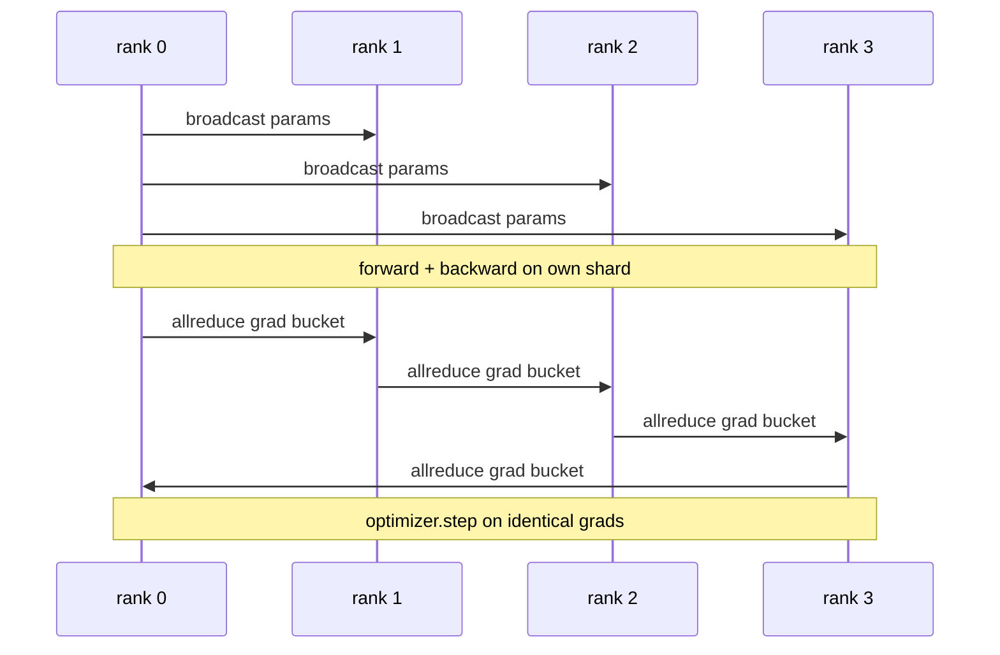

# 数据并行 DDP 从零实现

> DistributedDataParallel 是搭建在 allreduce 之上的钩子。包装一个模型，从 rank 0 广播初始参数使每个 rank 起点一致，在每个参数上安装反向钩子发起梯度的 allreduce，剩下的就是梯度下降。整个模式只需 200 行。

**类型：** 构建
**语言：** Python
**前置课程：** 第19阶段 C 轨道 第42-49课
**时长：** ~90 分钟

## 学习目标

- 构建一个 `DistributedDataParallel` 形式的包装器，广播初始参数并在反向传播后 allreduce 梯度。
- 使用 `torch.multiprocessing.spawn` 在 gloo 后端上通过基于文件的 rendezvous 启动 N 个 CPU rank。
- 通过在相同数据上顺序训练相同模型并展示每步参数等价性，证明梯度同步的正确性。
- 论证分桶（梯度融合）和重叠（反向传播期间通信）是将可用 DDP 变为生产 DDP 的两个关键改进。

## 问题所在

一个 10 亿参数、12 GB 激活的模型无法放入单张消费级 GPU。即使放得下，训练也需要数周。数据并行将批次拆分到 N 个 rank，每个 rank 在自己的分片上计算前向和反向，每一步所有 rank 的梯度被求和，使 N 个副本保持一致。求和后的梯度就是优化器步进的依据。

没有梯度同步，N 个副本在第 2 步就会发散。模型不再是"用更多数据训练的一个模型"，而是 N 个恰好共享初始权重的独立模型。梯度同步做得不好（每个参数一次 allreduce，无重叠，不分桶），网络成为瓶颈，GPU 空闲等待线路。DDP 的技艺在于使梯度同步相对于计算几乎免费。PyTorch DDP 的规范实现通过分桶梯度、将 allreduce 与下一层的反向重叠、以及在 NVLink 上使用 NCCL 实现了这一点。我们可以在 CPU 上用 gloo 做到这三点，学到相同的经验。

## 核心概念



### DDP 需要的三个操作

| 阶段 | 集合通信 | 原因 |
|-------|-----------|-----|
| 初始化 | 从 rank 0 广播 | 每个 rank 以相同参数开始 |
| 反向后 | 每个梯度的 allreduce | 平均梯度是优化器步进的依据 |
| 有时 | 缓冲区广播 | Batchnorm 运行统计量保持同步 |

### 为什么用均值而非求和

Allreduce-SUM 除以 world_size 得到平均梯度。均值对 world_size 不变：在一个 rank 上调优的学习率在四个 rank 上同样有效，因为每步梯度幅度不变。Allreduce-SUM 不除以 world_size 则每次更改集群规模都要重新调优学习率。DDP 封装了 SUM 并做除法；本课也这样做。

### 为什么要将梯度分桶

一个 transformer 有数千个参数张量。每个张量一次 allreduce 要付出数千次 gloo 延迟下限。DDP 将梯度分组为约 25 MB 的桶，每个桶发起一次 allreduce。相同的总字节数在线路上传输，但延迟被分摊到桶上。对于本课的小模型，我们将所有内容归入一个桶；重要的是结构。

### 为什么要固定种子

每个 rank 必须调用 `torch.manual_seed(seed + rank)` 来打乱数据，但调用 `torch.manual_seed(seed)` 来初始化参数。单一共享种子意味着每个 rank 看到相同的批次顺序（破坏了数据并行）；rank 特定种子用于参数意味着初始参数因 float epsilon 不同而梯度同步无法使副本一致。种子模式搞错，参数等价性测试在第 1 步就会失败。

## 构建它

`code/main.py` 实现了：

- `MiniMLP`：一个 3 层 MLP，小到几秒内收敛，大到足以暴露接线逻辑。
- `DistributedDataParallel(model, world_size)`：构造时广播参数，返回一个包装器，其 `sync_grads` 将累加的 allreduce 求和梯度除以 world_size。
- `worker(rank, world_size, ...)`：完整训练循环，包括 `torch.distributed` 在 gloo 上的初始化、前向、反向、同步、步进。
- `_reference_single_process_loop(...)`：在单个 rank 上用相同数据顺序训练相同模型，测试用其验证每步后参数的字节级等价性。

运行：

```bash
python3 code/main.py
```

输出：每步训练表，比较单进程损失和参数校验和与 4 个 rank 上 DDP 运行的结果。两条路径产生到 float epsilon 级别相同的损失曲线，证明梯度同步正确。

## 生产中的模式

三种模式使 DDP 足够健壮以投入生产。

**发现未使用参数。** 某些前向路径有条件地跳过参数（早退、混合专家路由器）。被跳过的参数没有梯度，但 DDP 的桶就绪钩子仍然等待它们，allreduce 死锁。`find_unused_parameters=True` 告诉 DDP 在归约前检查哪些参数获得了梯度。代价是每步一次图遍历，所以除非前向有分支否则不要开启。

**静态图优化。** 当前向在各步之间稳定时，`static_graph=True` 让 DDP 预计算桶调度。该优化在大规模时很重要：预计算每步节省几毫秒，在 10000 步中累积。

**梯度累积需要小心。** 在 K 个微批次上累积梯度而不在每个微批次同步是 10 倍吞吐量提升。DDP 提供 `no_sync()` 作为上下文管理器，暂停反向后的 allreduce。忘记使用管理器则白白 allreduce K 次；吞吐量跌至谷底。

## 使用它

生产模式：

- **PyTorch DDP。** 规范实现。`torch.nn.parallel.DistributedDataParallel(model)` 接入分桶、重叠和 no_sync 上下文。
- **HuggingFace Accelerate。** 添加启动器处理 `torchrun` 环境变量和模型包装。底层是相同的 DDP。
- **Megatron-LM 数据并行。** 将 DDP 与张量并行结合用于大模型；数据并行部分是相同的 allreduce-after-backward 模式。

## 交付它

第78课（ZeRO 分片）用 reduce_scatter 替换逐参数 allreduce，使每个 rank 只存储其优化器状态分片。第81课将 DDP 与 ZeRO 组合到端到端演示中。

## 练习

1. 添加可配置大小的梯度桶，在更深的模型上测量相比逐参数 allreduce 的加速。
2. 实现 `no_sync()` 作为上下文管理器，验证梯度累积与单进程基线在 K 个微批次上匹配。
3. 添加 `find_unused_parameters` 模式，前向有时跳过 MLP 的某一层；不设标志时运行应死锁。
4. 用 `torch.distributed.barrier()`-only 同步替换 gloo，感受基于 allreduce 和基于 barrier 的同步差异。
5. 测量批次大小为 1、16、256 时梯度同步开销占步时间的比例，解释其缩放规律。

## 关键术语

| 术语 | 人们常说的 | 实际含义 |
|------|----------------|------------------------|
| DDP | "数据并行" | 每步广播参数并 allreduce 梯度的包装器 |
| 桶 | "融合梯度" | 将 N 个小 allreduce 合并为一个大 allreduce |
| 重叠 | "隐藏通信" | 在后续层仍在计算反向时发起 allreduce |
| no_sync | "累积" | 跳过反向后的 allreduce 用于梯度累积 |
| find_unused | "分支前向" | 在归约前检测没有梯度的参数 |

## 延伸阅读

- [PyTorch DistributedDataParallel docs](https://pytorch.org/docs/stable/generated/torch.nn.parallel.DistributedDataParallel.html)
- [PyTorch DDP internals tutorial](https://pytorch.org/tutorials/intermediate/ddp_tutorial.html)
- [Li et al, PyTorch Distributed: Experiences on Accelerating Data Parallel Training](https://arxiv.org/abs/2006.15704)
- 第19阶段 第76课 - DDP 所基于的集合通信原语
- 第19阶段 第78课 - ZeRO 分片用 reduce_scatter 替换逐参数 allreduce
