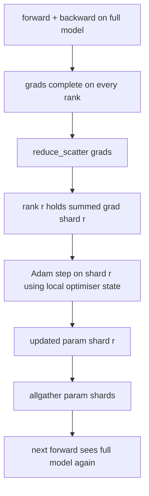

# ZeRO 优化器状态分片

> Adam 为每个参数存储两个矩估计，都是 float32。一个 70 亿参数的模型携带 56 GB 优化器状态。ZeRO 阶段 1 将其分片到 N 个 rank；每个 rank 拥有 1/N 的优化器。本地步进后，更新后的参数分片广播回来，每个 rank 重建完整模型，下一步开始。收益是训练栈中最大单分配的线性内存下降。

**类型：** 构建
**语言：** Python
**前置课程：** 第19阶段 C 轨道 第42-49课
**时长：** ~90 分钟

## 学习目标

- 将优化器状态（一阶矩、二阶矩、fp32 主副本）分片到 N 个 rank，使每个 rank 拥有 1/N。
- 使用 reduce_scatter 仅向每个 rank 传递其分片的梯度求和，然后 allgather 将更新后的参数分片广播回来。
- 计算阶段 1、阶段 2、阶段 3 相对于朴素 DDP 的内存节省表。
- 根据模型大小和带宽预算，论证选择阶段 1 还是阶段 2 还是阶段 3。

## 问题所在

朴素 DDP 复制一切：参数、梯度和优化器状态在每个 rank 上完整存在。对于 fp16 中的 70 亿参数模型，这意味着每个 rank 14 GB 参数、14 GB 梯度和 28 GB 优化器状态。优化器状态是最大的项，也是最容易分片的，因为它只在步进时被触碰，不在前向或反向时被触碰。

ZeRO 阶段 1 分片优化器状态。每个 rank 持有 1/N 的 Adam 矩。反向后，ZeRO 不再 allreduce 完整梯度并在本地步进，而是 reduce_scatter 使每个 rank 只接收其分片的求和梯度。rank 对其主参数分片应用优化器步进。更新后的参数分片然后 allgather 回来，使每个 rank 拥有完整模型用于下一次前向。优化器内存下降 N 倍。每步线路流量与 DDP 相同：一次 reduce_scatter 加一次 allgather 在带宽上等于一次 allreduce。内存赢了，吞吐量不变。

## 核心概念



### ZeRO 的阶段

| 阶段 | 分片内容 | 每 rank 内存 | 每步通信 |
|-------|----------------|------------------|---------------|
| DDP | 无 | params + grads + optim | 1x allreduce |
| ZeRO-1 | 优化器状态 | params + grads + optim/N | 1x reduce_scatter + 1x allgather |
| ZeRO-2 | 优化器 + 梯度 | params + grads/N + optim/N | 1x reduce_scatter + 1x allgather |
| ZeRO-3 | 优化器 + 梯度 + 参数 | params/N + grads/N + optim/N | 每层 1x allgather + 每层 1x reduce_scatter |

阶段 1 是最便宜的收益，因为优化器状态主导预算。阶段 2 需要梯度分片累积逻辑，但带宽相同。阶段 3（FSDP）为每次前向和反向付出逐层通信，换取参数分片的内存下降。本课完整实现阶段 1。

### 内存数学，真实数字

对于使用 Adam 混合精度训练的 P 参数模型：

| 项 | 朴素 | ZeRO-1 | 原因 |
|------|---------|--------|-----|
| fp16 参数 | 2P 字节 | 2P 字节 | 前向需要 |
| fp16 梯度 | 2P 字节 | 2P 字节 | 反向需要 |
| fp32 主副本 | 4P 字节 | 4P/N 字节 | 只有优化器使用 |
| fp32 一阶矩 | 4P 字节 | 4P/N 字节 | 只有优化器使用 |
| fp32 二阶矩 | 4P 字节 | 4P/N 字节 | 只有优化器使用 |
| 总计 | 16P 字节 | 4P + 12P/N 字节 |   |

N=8 时：朴素 16P，ZeRO-1 5.5P，下降 65%。N=64 时：朴素 16P，ZeRO-1 4.19P，下降 74%。

### 为什么 reduce_scatter 优于 allreduce-then-shard

Allreduce 给每个 rank 完整的求和梯度。如果你只需要分片 r，rank r 上 (N-1)/N 的归约梯度是浪费的。Reduce_scatter 精确传递每个 rank 拥有的分片；每 rank 字节数与 allreduce 相同（因为 allreduce 就是 reduce_scatter + allgather），但后半部分被稍后的参数分片 allgather 替代。净线路流量与 DDP 相同，内存被分割。

## 构建它

`code/main.py` 实现了：

- `flatten_params(module)` 和 `unflatten_into(module, flat)` 将模型参数打包为一个连续张量并解包回来。扁平布局使按 rank 分片成为简单切片。
- `ZeroOptimizer(model, world_size, rank, lr)` 拥有 rank 的主副本和 Adam 矩的分片。
- `step()` 对扁平梯度运行 reduce_scatter，对 rank 的分片应用 Adam，然后 allgather 更新后的参数。
- 一个演示，训练 3 层 MLP 20 步，打印每步内存预算与朴素 DDP 基线对比。

运行：

```bash
python3 code/main.py
```

输出：每步损失和内存表，显示 ZeRO-1 在每个 rank 上持有 1/N 的优化器状态，而 DDP 持有完整副本。

## 生产中的模式

三种模式使 ZeRO 足够健壮以投入生产。

**分片检查点很重要。** ZeRO-1 的优化器状态分散在各 rank；检查点必须记录哪个 rank 拥有什么。第80课构建分片检查点清单，使 ZeRO 运行可在相同 world size 上恢复。没有它，保存的状态在重启时不可读。

**混合精度是关键。** ZeRO 是混合精度技术；fp32 主副本才是被分片的部分。不用混合精度运行 ZeRO 付出 fp32 主副本的内存税却得不到对应的 fp16 前向收益。生产运行总是将 ZeRO 与 autocast 或 bf16 权重配对。

**阶段 1 是近乎免费的收益。** 通信在带宽上与 DDP 相同。内存节省与 N 线性。唯一代价是优化器分片的簿记。生产栈默认使用阶段 1，除非参数分片内存也是问题；那时阶段 2 或 3 用通信换内存。

## 使用它

生产模式：

- **DeepSpeed ZeRO。** 参考实现。`deepspeed_config.json` 选择阶段 1/2/3 和分区大小。
- **PyTorch FSDP。** PyTorch 原生等价物。`ShardingStrategy.SHARD_GRAD_OP` 是 ZeRO-2；`FULL_SHARD` 是 ZeRO-3。
- **HuggingFace Accelerate。** 在统一配置下封装 DeepSpeed 和 FSDP。

## 交付它

第79课（流水线并行）是正交的分片轴：不是跨同一模型分片优化器状态，而是跨 rank 分片层。第81课将 DDP + ZeRO 组合到端到端演示中。

## 练习

1. 扩展到 ZeRO-2：分片梯度，每个 rank 只存储其分片的梯度，通过在反向后清零非分片部分实现。
2. 添加内存分析器，打印 rank 0 上的实际 fp32 字节使用量与公式预测对比。
3. 测量朴素 DDP 与 ZeRO-1 的每步挂钟时间，分解为前向、反向、通信。
4. 在 ZeRO-1 下实现梯度裁剪：L2 范数必须通过 allreduce 各分片的局部范数平方来跨所有分片计算。
5. 实现用 allreduce 替代 reduce_scatter 的"朴素 ZeRO"，测量线路时间差异。用数据论证 reduce_scatter 的选择。

## 关键术语

| 术语 | 人们常说的 | 实际含义 |
|------|----------------|------------------------|
| ZeRO-1 | "分片优化器" | 每个 rank 持有 1/N 的 fp32 主副本 + Adam 矩 |
| ZeRO-2 | "也分片梯度" | 每个 rank 在 reduce_scatter 后也丢弃非分片梯度 |
| ZeRO-3 | "分片参数" | 每个 rank 持有 1/N 的 fp16 参数；前向每层 allgather |
| 主副本 | "fp32 权重" | 优化器更新的高精度参数副本 |
| Reduce_scatter | "拆分求和" | 仅向每个 rank 传递其分片的求和梯度 |

## 延伸阅读

- [Rajbhandari et al, ZeRO: Memory Optimizations Toward Training Trillion Parameter Models](https://arxiv.org/abs/1910.02054)
- [DeepSpeed ZeRO documentation](https://www.deepspeed.ai/tutorials/zero/)
- [PyTorch FSDP documentation](https://pytorch.org/docs/stable/fsdp.html)
- 第19阶段 第76课 - 本课所依赖的 reduce_scatter 和 allgather
- 第19阶段 第80课 - ZeRO 状态必须使用的分片检查点
