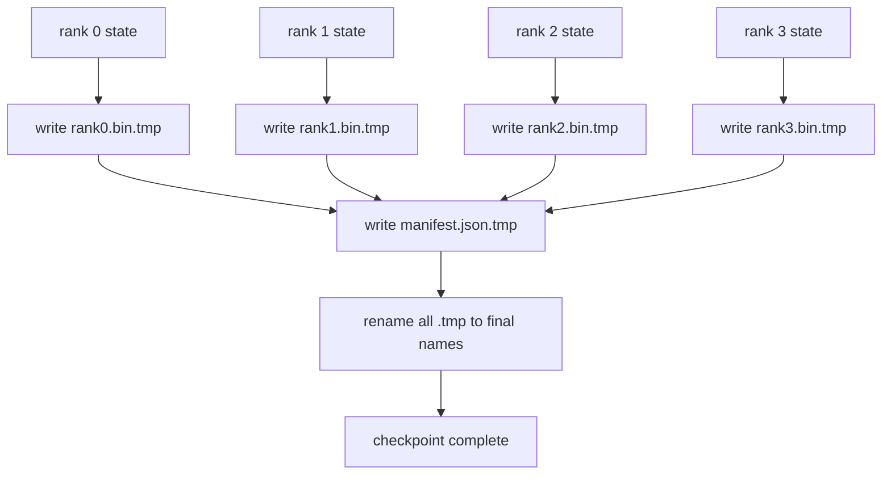

# 分片检查点与原子恢复

> 一个 700 亿参数的训练任务每隔几小时就被节点故障暂停。检查点格式决定你损失 30 分钟还是 30 小时。分片检查点并行写入每个 rank 的分片，并在清单中记录所有权。恢复时从各自文件加载每个 rank 的分片，在相同 world size 上重建状态，优化器像什么都没发生一样步进。原子写入防止半完成的检查点毒害下次恢复。

**类型：** 构建
**语言：** Python
**前置课程：** 第19阶段 C 轨道 第42-49课
**时长：** ~90 分钟

## 学习目标

- 将多 rank 检查点保存为每 rank 分片文件加记录哪个 rank 拥有什么的清单。
- 使用原子写入模式（写入临时路径然后重命名），使写入中途崩溃不会产生半完成的检查点。
- 从清单恢复，验证 fp16 参数和 ZeRO 优化器状态在每个 rank 上的字节级等价状态。
- 论证清单模式对三种故障模式的防御：world size 变更、分片数不匹配和部分写入。

## 问题所在

朴素检查点将所有参数和优化器状态读入 rank 0，收集，写入单个文件。对于 700 亿参数模型，这是 1.1 TB 状态通过一个 rank 的网络端口。写入阻塞每个其他 rank，因为它们空闲等待收集。IO 带宽是最慢单 GPU 的网络链路，而非聚合带宽。在真实集群上，收集-然后-写入步骤可能比前一个训练小时还长，意味着任务每天不到一个检查点。

分片检查点翻转模式：每个 rank 并行写入自己的分片到自己的文件。清单记录哪个 rank 拥有哪个分片，恢复时可将每个分片放回原处。聚合写入带宽随集群缩放。通过一个 rank 需要 4 小时的 1 TB 检查点，通过 64 个 rank 只需 4 分钟。此外清单给你不兼容恢复的合约：world size 变更可检测，部分写入可检测，加载路径可以大声失败而非静默使用过期数据。

## 核心概念



### 清单模式

```json
{
  "world_size": 4,
  "step": 1234,
  "wall_clock_seconds": 4521,
  "shards": [
    {"rank": 0, "path": "rank0.bin", "sha256": "...", "param_shard_offset": 0, "param_shard_numel": 65536},
    {"rank": 1, "path": "rank1.bin", "sha256": "...", "param_shard_offset": 65536, "param_shard_numel": 65536}
  ],
  "schema_version": 1
}
```

三个字段是承重的。`world_size` 使不同规模的恢复大声失败而非静默损坏。每个分片的 `sha256` 捕获部分或损坏的写入。每个分片的 `param_shard_offset` 和 `param_shard_numel` 让加载器在正确位置重建扁平参数张量。

### 原子写入

标准模式：将每个分片写入 `<name>.tmp`，将清单写入 `manifest.json.tmp`，对每个执行 fsync，然后重命名。同一文件系统内的 POSIX 重命名是原子的；新文件要么完全存在，要么旧文件仍在。最终重命名前的崩溃使前一个检查点成为活跃检查点。没有原子写入，崩溃可能留下部分分片和指向它的清单，加载时恢复会损坏优化器状态。

### 模式必须防御的三种故障模式

| 故障 | 症状 | 防御 |
|---------|---------|---------|
| World size 变更 | 用 N=4 的清单在 N=8 上恢复 | 清单中 world_size 不匹配，大声失败 |
| 分片数不匹配 | 恢复时看到的 rank*.bin 文件少于清单中的分片 | 枚举分片，验证每个都存在 |
| 部分写入 | 分片文件在刷新中途截断 | 加载时 sha256 验证 |

每种防御提前拒绝错误加载；替代方案是静默损坏，在 100 步后 loss 变 NaN 时才暴露。

### 为什么用每 rank 文件而非一个大文件

通过 `O_APPEND` 并发写入一个文件在 POSIX 上对字节对齐写入有效，但实践中一个分片内的偏移跨越 MB 级区域，锁竞争主导。每 rank 文件无竞争，且底层文件系统并行时（Lustre、GPFS）受益于条带化。生产栈（DeepSpeed、FSDP、NeMo）都因此使用每 rank 文件。

## 构建它

`code/main.py` 实现了：

- `ShardManifest` 数据类，包含上述模式加 `to_json`/`from_json`。
- `save_sharded(state_dict_per_rank, dir, step)` 使用原子临时-然后-重命名模式将每个 rank 的二进制状态写入自己的文件，然后写入清单。
- `load_sharded(dir, expected_world_size)` 读取清单，验证每个分片的 sha256，返回每 rank 状态字典。
- 往返测试：构建每 rank 状态，保存，加载，断言字节级等价。

运行：

```bash
python3 code/main.py
```

输出：4 个分片文件加清单写入，然后重新加载并验证字节级等价。

## 生产中的模式

三种模式使检查点足够健壮以投入生产。

**异步写入。** 生产栈在单独线程或进程上发起检查点写入，使训练继续。屏障在下一次检查点：在上一次完成之前不开始下一次保存。DeepSpeed 的 `async_io` 标志正是这样做的。本课保持写入同步以使步骤可见。

**先写本地快速磁盘，然后异步上传。** 写入本地 NVMe（快），然后异步上传到 S3 或 GCS。两层模式保持集群内检查点快速恢复，同时将持久副本离集群归档。清单携带本地路径；上传清单携带远程路径。

**轮转很重要。** 生产运行保留最近 K 个检查点（通常 3-5 个）并轮转最旧的。没有轮转磁盘在运行中途填满，下次检查点失败。有轮转则下次保存先删除最旧的，释放预算。

## 使用它

生产模式：

- **DeepSpeed 检查点。** `deepspeed.save_checkpoint(tag=step)` 写入每 rank 文件和指向活跃标签的 `latest` 文件。
- **PyTorch FSDP 检查点。** `torch.distributed.checkpoint` 使用决定每 rank 布局的 `Planner` 保存分片状态。
- **NeMo。** 用统一的 `save_to_checkpoint` API 封装 DeepSpeed 和 FSDP，添加元数据。

## 交付它

第81课保存端到端 DDP+ZeRO 运行的分片检查点，并在相同 world size 上重新加载，证明恢复合约成立。

## 练习

1. 添加异步写入：在线程中启动保存，让训练继续。阻塞下一次保存直到上一次完成。
2. 添加 `last_5_steps` 轮转：保留 5 个最近检查点，保存新检查点前删除最旧的。
3. 为内循环重载添加仅 CRC 的快速验证路径（轮转将检查点变为新的活跃检查点而无需完整 sha256）。
4. 添加跨 world size 加载：通过读取清单、拼接、重新分片从 N=4 重新平衡到 N=8。
5. 添加上传到伪 S3（第二个目录）并写入上传清单。论证两层存储策略。

## 关键术语

| 术语 | 人们常说的 | 实际含义 |
|------|----------------|------------------------|
| 分片检查点 | "每 rank 保存" | 每个 rank 并行写入自己的分片文件 |
| 清单 | "索引" | 记录分片路径、偏移和 sha256 的 JSON 文件 |
| 原子写入 | "临时再重命名" | 写入 .tmp 然后 POSIX 重命名，崩溃留下前一个文件活跃 |
| 部分写入 | "截断分片" | 写入期间崩溃产生损坏分片；sha256 捕获 |
| 轮转 | "保留最近 K 个" | 写入新检查点前删除最旧的以限制磁盘使用 |

## 延伸阅读

- [DeepSpeed checkpointing](https://www.deepspeed.ai/tutorials/checkpointing/)
- [PyTorch torch.distributed.checkpoint](https://pytorch.org/docs/stable/distributed.checkpoint.html)
- [POSIX rename atomicity](https://pubs.opengroup.org/onlinepubs/9699919799/functions/rename.html)
- 第19阶段 第78课 - 此检查点格式为之设计的 ZeRO 状态
- 第19阶段 第81课 - 端到端演示往返保存的状态
