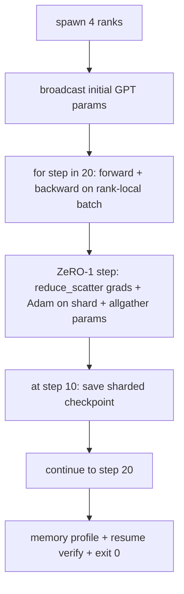

# 端到端分布式训练

> 第76到80课各构建了一个组件。这是组装：一个跨 4 个模拟 rank 训练的微型 GPT，使用 DDP 进行梯度同步，ZeRO-1 进行优化器状态分片，并在中点保存分片检查点。演示运行 20 步，自终止，打印损失曲线加内存配置，并写入可恢复的检查点。

**类型：** 构建
**语言：** Python
**前置课程：** 第19阶段 C 轨道 第42-49课
**时长：** ~90 分钟

## 学习目标

- 将 DDP（第77课）加 ZeRO-1（第78课）加分片检查点（第80课）组合到一个训练循环中。
- 在小型合成语料库上跨 4 个模拟 rank 训练 2 层 transformer 语言模型 20 步。
- 打印每步损失表、每 rank 内存配置和可在相同 world size 上字节级等价恢复的检查点清单。
- 论证组合：每个组件在先前课程中独立可测试，本课证明它们可组合。

## 问题所在

顶石课程证明各组件能组合在一起。第76课实现了集合通信。第77课将其封装为 DDP。第78课用 reduce_scatter 分片优化器状态。第79课分析了流水线。第80课保存了分片检查点。每课独立拥有自己的测试。真实训练运行同时使用每个原语；如果组合有误，损失发散，检查点拒绝恢复，或每 rank 内存该缩小时反而增长。

本课运行端到端演示并验证四个不变量：(a) 损失在 20 步内单调下降（在浮点噪声范围内），(b) 每个 rank 在每步持有相同参数范数，(c) 每 rank 优化器内存等于 ZeRO-1 公式 12P/N 字节，(d) 第 10 步的检查点在重启时字节级等价重新加载。演示自终止：20 步，单命令，退出码 0。

## 核心概念



### 微型 GPT

模型故意很小：2 个 transformer 块，嵌入维度 32，4 个注意力头，词表 64，序列长度 16，批次 4。几千个参数。大到足以锻炼每个接线决策（多头注意力运行标准掩码路径；LayerNorm 有需要同步的权重；LM 头是回到词表的独立线性投影）。小到 4 个 CPU rank 上 20 步几秒完成。

### 组合规则

| 课程组件 | 它负责什么 | 它留给循环的 |
|--------------|--------------|----------------------------|
| DDP 广播 | 初始参数同步 | 构造时一次调用 |
| ZeRO-1 步进 | 梯度同步，主副本更新，参数广播 | 每步一次调用替代 optimiser.step |
| 分片检查点 | 持久化每 rank 状态，带 sha256 的清单 | 在 rank 0 上通过 allgather 收集状态调用 |
| 训练循环 | 前向，反向，损失记录 | 按顺序调用上述三个 |

循环不知道 reduce_scatter 或 rendezvous 文件。ZeRO 和检查点模块暴露窄接口供循环组合。

### 为什么用微型 GPT 而不只是 MLP

第77课的 MLP 足以验证梯度同步。微型 GPT 增加了三件事：词表上的独立 LM 头（本课中为清晰起见不共享；完整 GPT 通常将头与 token 嵌入共享），softmax+交叉熵作为损失（比 MSE 有更多数值边界情况），以及不对称前向（嵌入然后注意力然后每层 MLP）。顶石课继续用 MLP 会隐藏组合是否正确处理 LayerNorm 或嵌入层的梯度形状。

### 自终止意味着退出码 0

循环运行固定 20 步并退出。没有 `while True`，无需人工干预，不从外部状态恢复。你可以让顶石课程无人值守运行，完成后找到完整日志，这证明系统接线正确。如果任何组件死锁，演示永不返回，测试框架会捕获。

## 构建它

`code/main.py` 实现了：

- `MiniGPT`：2 层 transformer，带掩码自注意力和独立 LM 头。
- `make_corpus(seed, total_tokens)`：确定性下一 token 预测数据。
- `_train_worker`：每个 rank 启动；广播初始参数，运行循环，调用 ZeRO 步进，在第 10 步写入分片检查点。
- `verify_resume`：主运行后，在进程内重新加载第 10 步检查点，断言保存的主分片与内存快照逐字节匹配。
- `main`：编排整个演示，打印损失表、内存配置和验证结果。

运行：

```bash
python3 code/main.py
```

输出：20 行损失表，4 行每 rank 内存配置，检查点清单，以及成功时的 "RESUME VERIFIED" 行。

## 生产中的模式

三种模式为真实运行完成组合。

**每 K 分钟检查点，而非每 K 步。** 步时间随序列长度和微批次数变化。10 分钟检查点节奏无论模型大小都捕获相同计算。本课为简单起见使用基于步的；生产使用基于挂钟时间的。

**早期检测发散。** 生产运行在反向后添加 NaN 守卫和损失尖峰检测器；如果损失一步内跳升超过 2 倍，回滚到前一个检查点而非让优化器进入退化状态。本课的损失曲线平滑所以守卫未使用但钩子保留。

**跨 rank 聚合内存配置。** 真实运行中每 rank 内存因 rank 而异（拥有最大流水线阶段的 rank 持有更多激活）。生产记录跨 rank 的最大值加均值；本课打印每 rank 以展示公式匹配。

## 使用它

生产模式：

- **DeepSpeed。** 在一个配置下组合 DDP + ZeRO + 流水线 + 激活检查点。本课的组合是 DeepSpeed 形态的缩影。
- **PyTorch FSDP。** 原生等价物。`FullyShardedDataParallel` 配 `ShardingStrategy.SHARD_GRAD_OP` 是 ZeRO-2。
- **NeMo 和 Megatron-LM。** 为最大模型添加张量并行；否则组合是相同形态。

## 交付它

完整轨道在此结束。6 课合在一起就是真实团队在采用 DeepSpeed 之前会构建的分布式训练子系统；抽象已针对 gloo 验证，故障模式已演练。第17阶段（基础设施与生产）是将此带到真实集群的地方。

## 练习

1. 添加注意力头的张量并行拆分，验证损失与单 rank 基线匹配。两个 rank：每个 rank 一半头，注意力输出的 allreduce。
2. 添加跨 4 个微批次的梯度累积，证明梯度等于一个大批次的梯度。
3. 添加从第 10 步恢复的路径，实际继续训练到第 20 步，产生与原始运行相同的最终损失。
4. 添加指标导出（损失、梯度范数、步时间）到 JSONL，使运行可事后可视化。
5. 添加在损失尖峰时回滚到前一个检查点的 NaN 守卫，用一步 LR 乘数强制制造尖峰以演练回滚。

## 关键术语

| 术语 | 人们常说的 | 实际含义 |
|------|----------------|------------------------|
| 端到端 | "全部接上" | 一次运行组合每个组件，而非每个组件的单元测试 |
| 内存配置 | "每 rank GB 数" | 每个 rank 持有的参数、梯度、优化器状态字节数 |
| 恢复合约 | "保存和加载" | 检查点往返后每 rank 状态字节级等价 |
| 自终止 | "有界运行" | 固定步数，完成时退出码 0，无需人工介入 |

## 延伸阅读

- [DeepSpeed end-to-end training tutorial](https://www.deepspeed.ai/getting-started/)
- [PyTorch FSDP advanced tutorial](https://pytorch.org/tutorials/intermediate/FSDP_advanced_tutorial.html)
- [Megatron-LM training script reference](https://github.com/NVIDIA/Megatron-LM)
- 第19阶段 第76-80课 - 本课组合的每个组件
- 第17阶段 - 将组合移至真实集群
