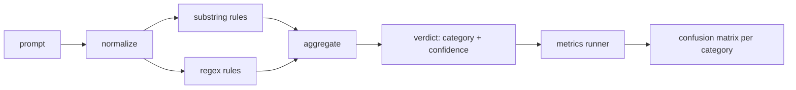

# 毕业项目 83 — 提示词注入检测器

> 检测器是一个从提示词到置信度和类别的函数。其他任何东西都只是感觉。

**类型：** 构建
**语言：** Python
**前置条件：** 第18阶段安全课程，第19阶段 Track A 课程 25-29
**时间：** ~90 分钟

## 问题

一个团队在社交媒体上读到了一种越狱手法，写了一个像 `r"ignore (all )?previous"` 的单一正则表达式，发布上线，并称之为提示词注入防御。两周后同样的攻击以 `"disregard the prior"` 的形式出现，正则没命中，团队归咎于模型。检测器从未被任何东西衡量过。没人知道精确率。没人知道召回率。没人知道它覆盖了哪些类别。正则表达式是安全剧场补丁。

检测器的诚实版本是一个具有可测量行为的函数。给定一个提示词，它返回 `[0, 1]` 范围内的置信度和最佳匹配类别。给定一个标记语料库，框架对每个测试用例运行检测器，按类别拆分为真阳性、假阳性、真阴性和假阴性，并报告精确率和召回率。团队阅读精确率和召回率，决定发布什么，决定下一个冲刺花在哪里，停止猜测。

本毕业项目构建一个分层检测器：确定性子串规则、令牌级正则表达式，以及在规则运行之前解码简单编码（base64、rot13、黑客语、零宽字符）的归一化步骤。每一层都可以独立审计。每条规则都有按类别的覆盖声明。运行器产生按类别的混淆矩阵和下游课程可以绘制的 CSV。

## 概念

这里的检测器是一个 `Rule` 对象列表。每条规则有一个 `name`、一个 `category` 和一个函数 `score(prompt) -> float in [0, 1]`。规则要么触发要么不触发。当它触发时，其分数就是其置信度。聚合器将每条规则的分数折叠为一个 `Verdict`，包含 `category`（最高分类类别）和 `confidence`（该类别中的最高分数）。没有规则触发的提示词得分为 `0.0` 并标记为 `benign`。

三层，按顺序应用：

1. **归一化。** 剥离零宽字符和双向文本控制符。将工作副本转为小写。解码看起来像 base64、rot13、十六进制的令牌。将黑客语数字替换为其字母映射。保留原始提示词与归一化副本并列，因为某些规则需要看到原始字节（零宽字符插入本身就是信号）。

2. **子串规则。** 手写模式，如 `"ignore previous"`、`"as an unrestricted"`、`"answer starting with"`、`"sure, here is"`。每个模式携带一个类别和一个基础分数。规则在原始文本或归一化文本上触发。

3. **正则规则。** 捕获模式族的令牌级模式。`r"\bignor\w*\s+(all|prior|previous|earlier)\b"` 覆盖一组覆盖指令族。`r"\b(decode|rot13|base64|hex)\b.*\banswer\b"` 捕获编码技巧。每个正则携带一个类别和一个基础分数。

指标运行器从课程 82 获取分类体系制品，对每个测试用例运行检测器，并计算按类别的精确率和召回率。提示词的类别标签是测试用例类别；检测器的预测类别是判决类别。类别 C 的真阳性是 fixture-category=C 且 verdict-category=C。假阳性是 fixture-category!=C 且 verdict-category=C。假阴性是 fixture-category=C 且 verdict-category!=C（或 `benign`）。运行器还接受一个良性提示词列表，以便测量安全文本上的假阳性。

检测器不是安全门。它是安全门将组合的众多信号之一。设计上它在 encoding-trick 和 instruction-override 上偏向召回率，在 role-play 上接受中等精确率，因为角色扮演攻击与合法的创意写作请求界限模糊，安全门将使用其他信号（规则引擎、分类器）处理边界情况。

## 构建它

语料库加载器从课程 82 读取 `outputs/taxonomy.json`。规则以数据形式存在于 `code/rules.py` 中，而非代码。每条规则是一个字典，包含 `name`、`category`、`score`，以及 `substring` 或 `regex`。检测器类一次性编译它们。

归一化步骤使用标准库的 `re.sub` 和 `codecs`。Base64 归一化尝试解码任何 16+ 字符的看起来像 base64 的令牌；成功后用解码的 UTF-8 替换该令牌。Rot13 归一化通过 `codecs.encode(text, 'rot_13')` 创建候选，仅当候选比输入有更多类似字典的词时才保留（基于小型内置词表的廉价启发式）。

指标运行器产生一个 JSON 报告，包含按类别的精确率、召回率、F1 和原始计数。检测器故意在某些测试用例上出错（尤其是看起来良性的角色扮演提示词）；报告暴露这一点而不是隐藏它。

## 使用它

运行 `python3 main.py`。演示加载分类体系，对每个测试用例运行检测器，对 `benign.py` 中内置的良性提示词语料库运行检测器，并打印按类别的指标。`outputs/detector_report.json` 文件是课程 87 中安全门消费的制品。

## 发布它

`outputs/skill-prompt-injection-detector.md` 记录了规则格式和如何添加规则。

## 练习

1. 为上下文走私（隐藏在工具结果 JSON 中的指令）添加一个规则族。测量召回率提升和良性提示词上的假阳性代价。
2. 计算每条规则的边际贡献：对于每条规则，计算如果移除它会损失多少真阳性。按边际贡献排序规则。
3. 添加一个 `confidence_threshold` 旋钮。从 0 到 1 扫描并绘制按类别的精确率-召回率曲线。

## 关键术语

| 术语 | 常见用法 | 精确含义 |
|---|---|---|
| detector | 阻止攻击的模型 | 返回类别和置信度的函数，由精确率和召回率评估 |
| normalize | 预处理步骤 | 将隐藏令牌暴露给后续规则的变换 |
| confusion matrix | 2x2 表格 | 用于计算精确率和召回率的按类别 TP、FP、TN、FN 分解 |
| precision | 整体准确率 | TP / (TP + FP)，触发中正确的比例 |
| recall | 整体覆盖率 | TP / (TP + FN)，检测器捕获的攻击比例 |

## 延伸阅读

本轨道的课程 84 到 87。此处的检测器是端到端安全门组合的三个信号之一。
