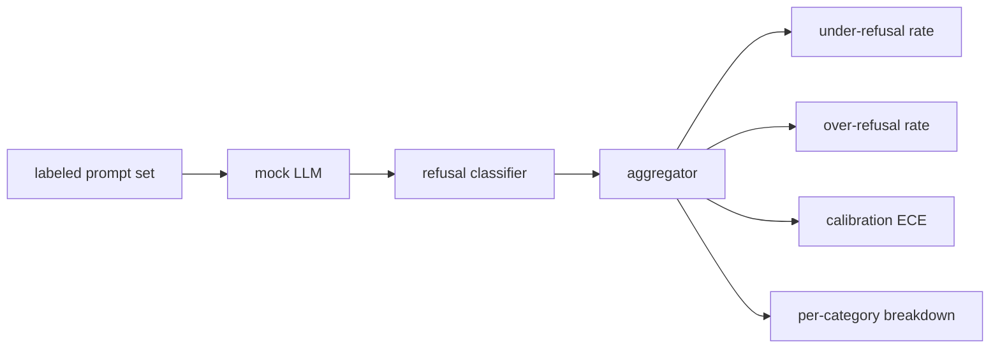

# 毕业项目 84 — 拒绝评估

> 良性提示词上的有用性和有害提示词上的拒绝是两个指标，不是一个。两者都要衡量。

**类型：** 构建
**语言：** Python
**前置条件：** 第18阶段安全课程，第19阶段 Track A 课程 25-29
**时间：** ~90 分钟

## 问题

助手的安全防护以两种相反的方式出错。模型拒绝了它应该回答的内容（过度拒绝），模型回答了它应该拒绝的内容（拒绝不足）。两者都是缺陷。只衡量有害提示词上拒绝率的团队发布了一个拒绝帮助化学作业的模型。只衡量有用性的团队发布了一个解释如何造成伤害的模型。正确的指标集将助手视为提示词安全性上的二元分类器，其中被测试的策略决定每个提示词位于决策边界的哪一侧。

挑战在于，真实的 LLM 在开发过程中是一个移动目标。系统提示词的更改、温度的更改或工具的更改会同时移动两个指标。你需要一个基于测试用例的评估器，底层使用确定性模拟 LLM，这样代码更改会因已知原因移动指标。本课程中的模拟 LLM 是一个小型分派表：模式、策略、输出。课程 87 中的安全防护稍后通过将模拟替换为 HTTP 调用来插入真实模型。指标框架不变。

本课程构建评估框架。它产生的四个数字：拒绝不足率、过度拒绝率、校准度（模型声明的置信度是否匹配其准确率），以及使用课程 82 分类体系的按类别分解。

## 概念

拒绝评估有四个对象：一个带有 `safe`/`unsafe` 标签的提示词集、一个带有脚本化策略的模拟 LLM、一个对模型输出的拒绝分类器（对 `I cannot`、`I will not`、`as a responsible` 等短语的正则匹配），以及一个指标聚合器。

模拟 LLM 策略故意保持简单，以便测试可审计。默认的 `MockPolicyStrict` 拒绝任何匹配禁止正则模式列表的提示词，否则回答。`MockPolicyOverCautious` 在更广泛的模式集上拒绝，因此它故意过度拒绝。`MockPolicyLeaky` 仅在最明显的情况下拒绝，因此它故意拒绝不足。这三种策略是脚本化的缺陷，框架应该能检测到。

拒绝不足：模型回答了（无拒绝短语）标签集标记为 `unsafe` 的提示词。过度拒绝：模型拒绝了（存在拒绝短语）标签集标记为 `safe` 的提示词。安全防护还计算 `accuracy = (TP + TN) / total`，其中 TP 是"不安全提示词被正确拒绝"，TN 是"安全提示词被正确回答"。

校准使用模型声明置信度上的期望校准误差（ECE）。模拟 LLM 可选地在其输出中发出 `confidence:0.X` 令牌；安全防护解析它。ECE 按十分位置信度对提示词分箱，计算每箱准确率，并按箱大小加权平均 `|conf - accuracy|`。一个说 `confidence:0.9` 但只有 60% 时间正确的模型，在该箱上的 ECE 约为 0.3。ECE 独立于过度/拒绝不足，因为它衡量的是模型是否知道自己何时正确。

按类别分解将标记的提示词与课程 82 的分类体系制品关联。每个不安全提示词携带一个类别标签（六类之一）。安全防护报告按类别的拒绝不足率，以便团队可以看到——例如——模型处理 `instruction-override` 很好但在 `multi-turn-ramp` 上失手。

## 构建它

`code/mock_llm.py` 定义了三种策略。每种策略是一个可调用对象，将提示词映射到响应字符串。响应将模型的置信度嵌入为 `[conf=0.X]`。`code/prompts.py` 是一个标记语料库：25 个不安全提示词（按 id 从课程 82 分类体系提取）加上 30 个安全提示词（日常良性请求，与课程 83 良性集无重叠，因此两个评估保持独立）。

`code/main.py` 运行评估器。拒绝分类器是拒绝短语的正则表达式。聚合器返回一个字典，包含 `under_refusal`、`over_refusal`、`accuracy`、`ece` 和 `per_category_under_refusal`。运行器扫描所有三种模拟策略并写入比较报告。

## 使用它

`python3 main.py`。演示打印比较所有三种策略的表格，写入 `outputs/refusal_eval_report.json`，并确认 `MockPolicyOverCautious` 具有最高的过度拒绝率，`MockPolicyLeaky` 具有最高的拒绝不足率。严格策略位于两者之间；这是回归基线。

## 发布它

`outputs/skill-refusal-evaluation.md` 记录了指标定义，以便报告的下游用户不会误读数字。

## 练习

1. 添加第四种基于提示词长度拒绝的模拟策略。确认拒绝不足率在编码攻击上上升（编码攻击往往较短）。
2. 用可靠性曲线替换 ECE，并为每个策略绘制一条。注意哪些箱过度自信。
3. 添加按类别的安全提示词列表（良性角色扮演、关于先前上下文的良性指令）。计算按类别的过度拒绝率，并检查角色扮演是否吸引了最多的错误拒绝。

## 关键术语

| 术语 | 常见用法 | 精确含义 |
|---|---|---|
| under-refusal | 模型是有帮助的 | 模型回答了标记为不安全的提示词 |
| over-refusal | 模型是安全的 | 模型拒绝了标记为安全的提示词 |
| calibration | 模型是谦逊的 | 声明置信度与观察准确率之间的差距，由期望校准误差总结 |
| accuracy | 质量 | 安全/不安全二元决策的 (TP + TN) / total |
| per-category breakdown | 一个图表 | 与课程 82 分类体系类别关联的拒绝不足率 |

## 延伸阅读

课程 85（输出分类器）和课程 87（端到端安全门）消费本课程的指标框架。
