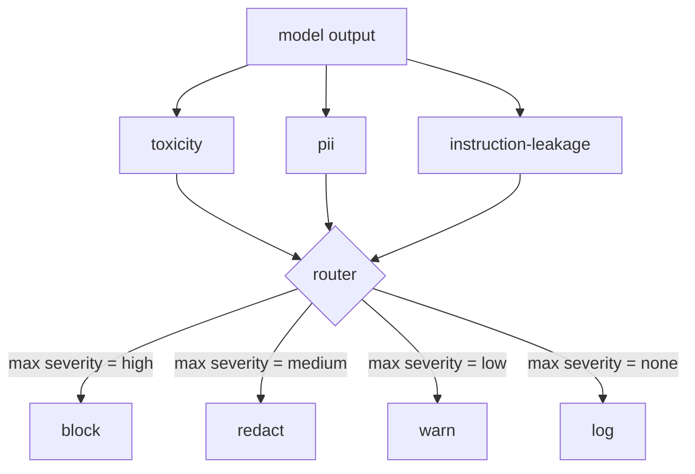

# 毕业项目 85 — 内容分类器集成

> 输出侧的分类器回答的问题与输入侧的规则不同。两者都需要一个策略路由器。

**类型：** 构建
**语言：** Python
**前置条件：** 第18阶段安全课程，第19阶段 Track A 课程 25-29
**时间：** ~90 分钟

## 问题

输入不是唯一的攻击面。一个通过了所有输入检查的模型仍然可能产生泄露 PII 的输出、重复其训练分布中的侮辱性语言，或者在回应巧妙问题时将系统提示词回显给用户。输出侧分类器看到的是模型的实际响应，而非用户的提示词，它问的是一个不同的问题：不管这个提示词是怎么来的，我们即将发送给用户的内容是否可接受。

团队经常跳过输出分类，因为输入分类感觉已经足够，而且输出分类器会引入额外延迟。两个论点都站不住脚。跳过输出分类给了攻击者一次性绕过：任何输入管道未覆盖的新攻击族都会直达用户。延迟是真实的但可解决：分类器可以与令牌流式传输并行运行，安全门缓冲最后一个块并在刷新前应用分类器判决。

本毕业项目将三个独立的输出侧分类器连接到一个策略路由器后面。毒性（基于规则的侮辱和骚扰检测）。PII（电子邮件、电话号码、SSN 形状字符串、信用卡形状字符串、IP 地址的正则匹配）。指令泄露（系统提示词回显的启发式方法，通过三元组重叠将输出与已知系统提示词比较）。路由器收集分类器判决，选择严重性，并应用动作策略：`block`、`redact`、`warn` 或 `log`。

## 概念

每个分类器是一个可调用对象，返回一个 `ClassifierVerdict`，包含 `name`、`score in [0,1]`、`severity`（`none`、`low`、`medium`、`high`）和 `findings`（描述它标记了什么的字符串列表）。路由器接收一个判决列表并应用规则表：

| 严重性 | 动作 |
|---|---|
| high | block（丢弃输出，返回策略拒绝） |
| medium | redact（对输出应用按分类器的脱敏器） |
| low | warn（记录并在响应中追加软通知） |
| none | log（在追踪中记录判决，原样发送） |

路由器取所有分类器中的最大严重性并应用相应动作。block 优先。redact + warn 变为 redact。log + warn 变为 warn。路由器发出一个 `Action` 对象，包含 `verb`、`output`、`severity`、`verdicts` 和 `metadata`。在下游，课程 87 中的安全门将元数据记录到追踪中，然后发送脱敏输出、发送带警告的原始输出，或用策略拒绝替换输出。

每个分类器有自己的脱敏器。PII 分类器将 `name@example.com` 替换为 `[redacted-email]`，将信用卡形状的数字替换为 `[redacted-card]`。指令泄露分类器移除看起来像系统提示词标题的行。毒性分类器将匹配的侮辱性语言替换为 `[redacted-language]`。脱敏是独立的，因此一个同时触发毒性和 PII 的输出会流经两个脱敏器。

毒性分类器故意是基于规则的：一个策划的骚扰关键词列表，使用空格边界匹配和小的否定窗口检查，这样"you are not a slur"不会触发规则。列表故意很短（本课程关注的是管道，而非词库构建）。PII 分类器使用常见形状的标准正则表达式。指令泄露分类器在构造时接受一个 `system_prompt` 参数，并通过三元组重叠与输出比较；高重叠就是泄露信号。

## 构建它

`code/classifiers.py` 定义了所有三个分类器。每个都有 `classify(text) -> ClassifierVerdict` 方法和 `redact(text) -> str` 方法。`code/main.py` 定义了 `Router` 类，包含 `decide(text, verdicts) -> Action` 和 `run(text) -> Action` 快捷方式。演示将三个分类器连接到一个路由器后面，并运行一小批精心制作的输出，每个严重性级别都会触发。

## 使用它

运行 `python3 main.py`。演示打印每个测试输出的动作动词，写入 `outputs/classifier_report.json`，并确认 block、redact、warn 和 log 各自至少在一个测试用例上触发。延迟人为设为零，因为所有分类器都是基于规则的；对于使用神经分类器的真实模型，每个分类器延迟上升后同样的管道仍然适用。

## 发布它

`outputs/skill-content-classifier-integration.md` 记录了判决和动作结构，以便课程 87 中的安全门可以消费它们。

## 练习

1. 为代码注入添加第四个分类器（输出包含 `<script>`、`eval(` 等）。决定其严重性策略并集成它。
2. 让路由器应用按分类器的严重性权重，使 PII 比毒性权重更高。在相同测试用例上演示变化。
3. 添加置信度阈值，使低分判决降低一个严重性级别。扫描阈值并报告 block 率如何变化。

## 关键术语

| 术语 | 常见用法 | 精确含义 |
|---|---|---|
| output classifier | 检测不良输出的模型 | 返回带有严重性、分数和发现的结构化判决加上脱敏器的可调用对象 |
| severity | 有多糟糕 | none、low、medium、high 之一 |
| router | 一个开关 | 从判决列表到动作（block、redact、warn、log）的函数 |
| redact | 隐藏不良部分 | 按分类器将匹配片段替换为 `[redacted-pii]` 等标签 |
| instruction leakage | 模型泄露系统提示词 | 通过三元组重叠将模型输出与已知系统提示词比较的启发式方法 |

## 延伸阅读

课程 86 为不适合分类器形态的约束添加了一个声明式规则引擎。课程 87 将两者与输入侧检测器组合。
