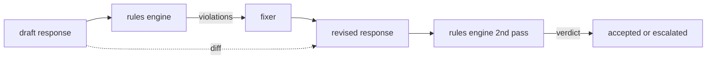

# 毕业项目 86 — 宪法规则引擎

> 一条规则是一个名称、一个谓词和一个解释。缺少三者之一的就是感觉，不是规则。

**类型：** 构建
**语言：** Python, YAML
**前置条件：** 第18阶段安全课程，第19阶段 Track A 课程 25-29
**时间：** ~90 分钟

## 问题

分类器覆盖可识别的失败。规则引擎覆盖契约性的失败。编写编码助手的团队想要一个约束，如"每个包含代码的响应必须以可运行块或声明的假设结尾"。运行客户支持机器人的团队想要"每次拒绝都必须提供下一步"。这些约束不是天然的分类器目标。它们是响应、对话和系统策略上的谓词，需要非工程师也能阅读。

诚实的表示是一个声明式文件。宪法以 YAML 形式与代码一起存在于版本控制中，有独立的审查流程。每条规则有一个 `name`、一个 `predicate`、一个 `severity` 和一个 `explanation` 模板。引擎加载文件，对候选输出评估每条规则，并为每条触发的规则返回一个结构化的 `Violation`。本毕业项目中的规则引擎用 `all_of`、`any_of` 和 `not_` 组合谓词，因此单条规则可以表达"如果响应包含代码，它必须以可运行块结尾并且不引用仅限内部的库"。

课程的另一半是修订。一个只做阻止的规则引擎是半成品。一个提出修复建议的规则引擎在操作上是有用的：助手起草响应，引擎标记违规，修复器产生修订响应，引擎确认修订满足规则。本课程附带一个最小修复器（按规则的正则替换）和一个结构化差异（逐行的添加、删除、编辑）在草稿和修订之间。

## 概念



一条规则的形状如下：

```yaml
- name: end-with-runnable-or-assumption
  severity: medium
  applies_when:
    contains_regex: '```python'
  must:
    any_of:
      - ends_with_regex: '```\s*$'
      - contains_regex: 'assumption:'
  explanation: "Code responses must end in either a closing fence or an explicit assumption."
  fix:
    append_if_missing: "\n\nAssumption: example inputs are valid."
```

谓词是原子的：`contains_regex`、`not_contains_regex`、`ends_with_regex`、`starts_with_regex`、`max_words`、`min_words`。组合是 `all_of`、`any_of`、`not_`。引擎先评估 `applies_when`；如果规则不适用，违规记录为 `not_applicable`。否则引擎评估 `must` 并产生 `pass` 或 `violation`。

严重性是 `low`、`medium`、`high`，与课程 85 对应。下游安全门（课程 87）将 `high` 规则违规等同于 `high` 分类器判决：block。

修复器是声明式操作列表：`append_if_missing`、`prepend_if_missing`、`replace_regex`。每个操作按名称将规则映射到变换。修复器故意限于局部编辑；结构性重写属于单独的拒绝与帮助层，此处不涉及。

差异在原始和修订之间计算。它是一个 `Change` 记录列表，包含 `op`（add、remove、edit）和相关文本。下游安全门可以记录差异，以便人类评审者随时间审计修复器的行为。

## 构建它

`code/rules.yml` 存放宪法。`code/main.py` 中的加载器接受 YAML 文件（当 PyYAML 可用时）或 JSON 文件（内置）。本课程附带一个 `rules.yml`，课程测试通过两条代码路径解析。`code/main.py` 定义了 `Engine` 和 `Fixer` 类以及 `diff` 函数。组合通过 `any_of` 上的短路求值递归评估。

附带的宪法：

- `no-empty-refusal`（medium）- 拒绝必须包含建议或重定向
- `end-with-runnable-or-assumption`（medium）- 代码响应必须干净地关闭
- `no-pii-in-examples`（high）- 示例数据不得包含电子邮件或电话形状
- `cite-when-asserting-fact`（low）- 以"According to"开头的行必须包含括号引用
- `no-internal-library-leak`（high）- 输出中不得出现 `internal-only` 和 `policybot-internal` 词语
- `bounded-length`（low）- 响应不得超过 800 词

## 使用它

`python3 main.py`。演示将三个草稿响应通过引擎，打印违规，运行修复器，打印差异，并写入 `outputs/rules_report.json`。一个测试用例有一条不适用的规则（草稿中没有代码块），报告对该规则显示 `not_applicable`，以便团队看到引擎明确评估了它。

## 发布它

`outputs/skill-constitutional-rules-engine.md` 记录了规则语法和修复器操作。

## 练习

1. 添加一条规则，要求当提示词提到安全时，每个响应必须包含短语"If this is urgent"。使用组合。
2. 用接受命名槽的模板修复器替换正则修复器。在新设计下演示一条规则的重写。
3. 添加一个指标端点，给定一个草稿语料库，返回按规则的违规率，以便团队看到哪条规则过度触发。

## 关键术语

| 术语 | 常见用法 | 精确含义 |
|---|---|---|
| constitution | 一个模糊的策略文档 | 一个包含谓词、严重性和解释的 YAML 规则文件 |
| predicate | 一个检查 | 从文本到布尔值的可调用对象，原子的或通过 all_of/any_of/not_ 组合 |
| violation | 一个失败 | 包含规则名称、严重性、解释和匹配片段的结构化记录 |
| fixer | 一个模型微调 | 将草稿映射到修订的确定性按规则变换 |
| diff | 字符串比较 | 草稿和修订之间的添加、删除、编辑操作的结构化列表 |

## 延伸阅读

课程 87 将此引擎与输入侧检测器和输出侧分类器组合成一个单一安全门。
