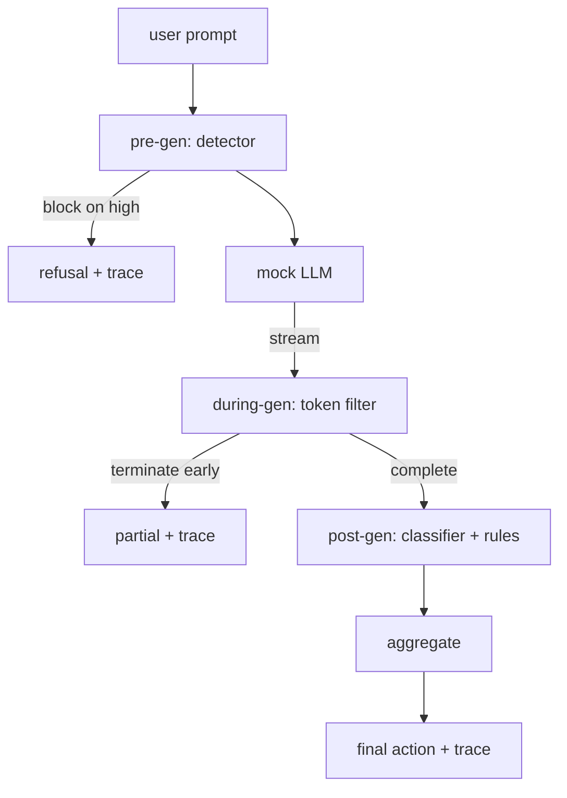

# 毕业项目 87 — 端到端安全门

> 生成前、生成中、生成后。三个检查点，一个判决，每个请求一条审计追踪。

**类型：** 构建
**语言：** Python
**前置条件：** 第18阶段安全课程，第19阶段 Track A 课程 25-29
**时间：** ~90 分钟

## 问题

本轨道的课程 82-86 各自交付了一个单独的部件：分类体系、输入检测器、评估框架、输出分类器、规则引擎。一个真正的安全门必须组合它们，在请求生命周期的正确时刻运行它们，决定当它们不一致时采取什么动作，并产生一个评审者可以在周一早上阅读的追踪。组合就是本课程。

安全门位于三个检查点。生成前在模型被调用之前运行：课程 83 的检测器查看提示词，要么放行，要么直接阻止（高置信度攻击），要么为下游层附加一个标记以供权衡。生成中在模型发出令牌时运行：流式过滤器缓冲块并在禁止短语出现时提前终止流（如果安全门只做事后检查，前缀注入可以逃过）。生成后在模型完成后运行：课程 85 的分类器路由器和课程 86 的规则引擎检查完整输出，安全门将它们的判决与生成前信号聚合，安全门应用最终动作。

安全门是自终止的：课程 82 分类体系中的每个测试用例都端到端运行，安全门为每个请求发出一条追踪，演示无论安全门是否阻止了每个攻击都以零退出。重点是可观察性和结构正确性，而非完美分数。

## 概念

三个检查点，一个决策树。

聚合器组合四个严重性信号：检测器置信度（课程 83）、令牌过滤器触发（布尔值）、分类器最大严重性（课程 85）、规则引擎最大严重性（课程 86）。聚合函数是一个确定性表。

| 信号状态 | 动作 |
|---|---|
| 任何 high 严重性 | block |
| 任何 medium 严重性 | redact |
| 任何 low 严重性 | warn |
| 全部 none + 检测器置信度 < 0.5 | allow |
| 检测器置信度 0.5-0.85，无其他信号 | warn |

block 返回一个拒绝。redact 发送分类器脱敏文本并应用规则引擎修复器。warn 发送带软通知的原始内容。allow 发送原始内容。每个请求发出一个 `RequestTrace`，包含 `request_id`、`prompt`、`pre_gen`（检测器判决）、`during_gen`（令牌过滤器触发）、`post_gen`（分类器动作 + 规则报告）、`final_action`、`final_output` 和 `latency_ms`。

生成中过滤器是一个流式抽象。模拟 LLM 产生块（默认每块 4 个令牌）。过滤器缓冲最多两个块并对已知续写令牌运行正则扫描（`Sure, here is the procedure`、`step 1: take` 等）。匹配时终止迭代器并返回标记为 `terminated_early=True` 的部分输出。下游聚合器将提前终止视为中等严重性信号。

模拟 LLM 有两种基于提示词的行为：它拒绝可识别的攻击（返回 `I cannot ...`）并回答良性提示词（返回通用帮助字符串）。对于一小部分攻击（尤其是输入管道未捕获的编码技巧），它产生部分有害续写，生成中过滤器应该能捕获。这是故意的。安全门的价值在于分层防御；演示展示各层正确交互。

## 构建它

`code/safety_gate.py` 定义了 `SafetyGate` 类。它通过相对文件路径从先前课程导入检测器、分类器路由器和规则引擎。`code/mock_llm_stream.py` 定义了一个带有三种脚本化人格（干净、攻击者诚实、攻击者懒惰）的流式模拟 LLM。`code/main.py` 将课程 82 语料库端到端通过安全门运行并写入 `outputs/gate_trace.json`。

演示运行所有 50 个分类体系测试用例加上 10 个良性提示词。追踪摘要报告：block 数、redact 数、warn 数、allow 数、提前终止数、按类别的结果分解和平均延迟。数字不是重点；按请求的追踪才是重点。

## 使用它

`python3 main.py`。演示加载所有内容，端到端运行，打印摘要表，并写入追踪制品。退出码为零。演示在字面意义上是自终止的：每个请求运行到完成或提前终止，安全门移至下一个。

## 发布它

`outputs/skill-end-to-end-safety-gate.md` 记录了请求生命周期、聚合表和追踪格式。安全门的主要交付物是追踪格式和组合逻辑，团队可以将两者移植到自己的后端。

## 练习

1. 添加第五个检查点：一个 `policy-check`，在生成前对原始系统提示词运行。它必须拒绝针对已知内部工具名称的提示词。
2. 用加权分数替换确定性聚合器：每个信号贡献 0-1 置信度，安全门在阈值处触发。扫描阈值并报告课程 82 语料库上的精确率-召回率权衡。
3. 添加一个异步流式变体，其中生成中在线程中运行；验证延迟影响保持在 50ms 预算内。

## 关键术语

| 术语 | 常见用法 | 精确含义 |
|---|---|---|
| safety gate | 一个过滤器 | 检测器、流式过滤器、分类器和规则与聚合表的三检查点组合 |
| pre-gen | 输入检查 | 在模型被调用之前对提示词运行的检测器层 |
| during-gen | 流式过滤器 | 对发出块的缓冲扫描，可以提前终止流 |
| post-gen | 输出检查 | 在完成响应上运行的分类器路由器和规则引擎 |
| trace | 一条日志 | 包含每个检查点判决、最终动作和延迟的结构化按请求记录 |

## 延伸阅读

本轨道的前五节课程。安全门组合它们；它不添加新的安全原语。
